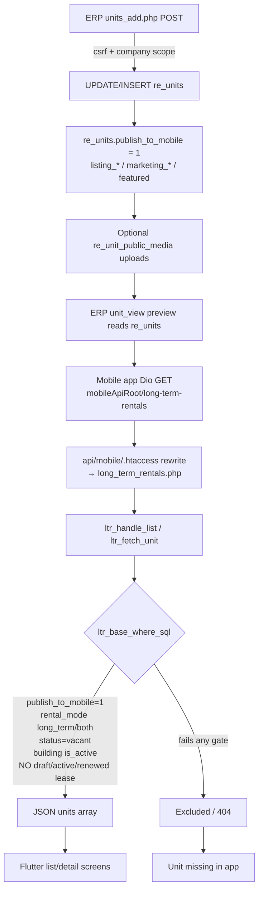

# Mobile Long-Term Unit Publication Regression Audit

**Date:** 2026-07-22  
**Scope:** Real Estate → Find Your Home (mobile long-term listing)  
**Mode:** Audit only — no code, schema, data, API contract, or mobile changes were made  
**Evidence labels:** Confirmed from code | Confirmed from production API | Confirmed from local DB | Confirmed from schema artifact | Strong inference | Needs production database confirmation

---

## 1. Executive summary

The mobile app is **not** the first failure point. Production API `GET /api/mobile/long-term-rentals` returns **12** units and **does not include Unit 85 (415)**. Detail `GET /api/mobile/long-term-rentals/85` returns **HTTP 404** `Rental unit not found`.

ERP UI for Unit 85 shows **Published to Mobile**, **Vacant**, **Long Term Only**, and **No active lease**. That combination can still fail the API because the API occupancy gate is **stricter and differently shaped** than the ERP “Active Lease” panel:

| Layer | Occupancy rule |
|-------|----------------|
| ERP `unit_view.php` “Active Lease” | `re_leases.status = 'active'` only (+ tenant INNER JOIN) |
| Mobile API `ltr_base_where_sql()` | Blocks if **any** lease with `status IN ('draft','active','renewed')` is linked via `re_leases.unit_id` **or** `re_lease_units.unit_id`. **Does not** ignore soft-deleted drafts (`deleted_at`). |

**First confirmed failure point:** API eligibility filter in `api/mobile/long_term_rentals.php` → `ltr_base_where_sql()` / `ltr_fetch_unit()` (unit never enters JSON).

**Root-cause classification:** **E. API filter excludes new records** (with contributing ERP/API occupancy-definition mismatch).  
Exact blocking lease row for Unit 85 on production: **Needs production database confirmation** (read-only SQL provided below). Local DB still shows historical active lease `#65` on unit 85; production ERP UI implies that lease is no longer `active`, so production blockers are most likely `draft` / `renewed` / soft-deleted draft / orphaned `active` hidden by tenant join.

---

## 2. Confirmed symptoms

| Symptom | Evidence |
|---------|----------|
| Mobile app unchanged | User statement; local Flutter Find Home still calls `/api/mobile/long-term-rentals` |
| Old published units still appear | Production list includes e.g. 73, 31, 49, 145 |
| Newly listed Unit 85 saved in ERP, visible as published | Screenshots `unit_view.php?id=85`, `units_add.php?id=85#publishToMobile` |
| Unit 85 absent from mobile | Production list `has_85=false`; detail 404 |
| Regression after recent DB/API deploy | User statement; lease lifecycle soft-delete (`deleted_at`) exists in schema; API never references it |

---

## 3. End-to-end publication flow diagram



**No SQL view** is used for this listing path. Confirmed from code: query is inline on `re_units` + `re_buildings` + optional `re_unit_public_media`.

---

## 4. ERP save-flow trace

| Item | Value |
|------|-------|
| View route | `/modules/realestate/unit_view.php?id=85` |
| Edit route | `/modules/realestate/units_add.php?id=85#publishToMobile` |
| Main PHP | `modules/realestate/units_add.php` |
| Authz | `require_login()` + `require_module_access(..., MODULE_REALESTATE)` |
| CSRF | `csrf_verify()` on POST |
| Company scope | `current_company_id($conn) ?: 1` then `WHERE id = ? AND company_id = ?` |
| Toggle field | `publish_to_mobile` checkbox `value="1"` / id `publishToMobile` |
| POST param | `publish_to_mobile` → `$publishToMobile = !empty($_POST['publish_to_mobile']) ? 1 : 0` |
| Write target | Table `re_units` |
| Enabled value | `1` |
| Disabled value | `0` (unchecked) |
| Secondary tables | Media via `unit_public_media_upload.php` → `re_unit_public_media`; floor plan also sets `re_units.floor_plan_file` |
| Audit | `audit_bridge_re_ops(... unit_updated/unit_created ...)` best-effort |
| Schema ensure | `re_unit_public_ensure_schema($conn)` adds columns/tables if missing |

**ERP does write the field the API reads** (`publish_to_mobile`). Confirmed from code.  
**Not** writing ARS short-term flag `is_listed` for this toggle. Confirmed from code.

---

## 5. Relevant database fields

### `re_units` (long-term publication)

| Column | Type / default | Written by ERP long-term UI | Read by mobile LTR API |
|--------|----------------|-----------------------------|-------------------------|
| `publish_to_mobile` | TINYINT(1) DEFAULT 0 | Yes | Yes (`= 1`) |
| `rental_mode` | ENUM long_term/short_term/both | Yes | Yes (`IN ('long_term','both')`) |
| `status` | ENUM vacant/occupied/maintenance/reserved | Yes | Yes (`= 'vacant'`) |
| `marketing_status` | ENUM ready_to_move/... | Yes | Optional filter / badges |
| `listing_title`, `listing_description` | varchar/text | Yes | Yes (response) |
| `featured`, `sort_order` | tinyint/int | Yes | Sort / filter |
| `cheques_count`, deposits, beds/baths, amenities, contacts, map/tour | various | Yes | Yes (response) |
| `is_listed` | TINYINT — **ARS short-term portal** | Not by this toggle | **Not** by LTR API |
| `listing_title` / ARS fields | shared columns historically | Shared | LTR uses them when set |

Sources: `migrations/re_find_home_phase1.sql`, `unit_public_listing_helper.php`, backup schema artifact.

### Related tables

| Table | Role |
|-------|------|
| `re_buildings` | INNER JOIN; must `is_active = 1` and same `company_id` |
| `re_unit_public_media` | LEFT JOIN photos/floor plans — **not required** to appear |
| `re_leases` + `re_lease_units` | Occupancy exclusion in API |
| `re_unit_viewing_requests` / `re_unit_lease_applications` | Lead capture only |

### Overlap / legacy risk

- **`is_listed` vs `publish_to_mobile`:** duplicate “visibility” concepts for different products (ARS stay vs Find Your Home). LTR API correctly uses `publish_to_mobile`. Confirmed from code.
- Soft-delete on leases (`deleted_at`) is used by ERP lease lifecycle helpers but **not** by LTR API. Confirmed from code.

---

## 6. Relevant views and definitions

| Check | Result |
|-------|--------|
| Dedicated SQL view for Find Your Home listings | **Not found** |
| API uses | Direct SQL in `ltr_unit_select_sql()` + `ltr_base_where_sql()` |
| AR ageing / booking views | Unrelated |

---

## 7. API endpoint and filtering trace

### Routing

| Item | Value |
|------|-------|
| Mobile config root | `AppConfig.mobileApiRoot` = production API base with `/api/customer/v1` → `/api/mobile` |
| Production list URL | `https://sys.saifholdinggroup.com/api/mobile/long-term-rentals` |
| Rewrite | `api/mobile/.htaccess` → `long_term_rentals.php` |
| Auth | Public (no JWT required for list/detail) |
| Cache headers | None observed on production response (`Cache-Control` / CDN cache headers absent) |
| Rate limit file | Temp-dir rate limit for POST leads only; list is not response-cached |

### Base eligibility (`ltr_base_where_sql`)

```sql
u.publish_to_mobile = 1
AND u.rental_mode IN ('long_term', 'both')
AND u.status = 'vacant'
AND NOT EXISTS (
  SELECT 1
  FROM re_leases l
  LEFT JOIN re_lease_units lu ON lu.lease_id = l.id
  WHERE l.company_id = u.company_id
    AND l.status IN ('draft','active','renewed')
    AND (l.unit_id = u.id OR lu.unit_id = u.id)
  LIMIT 1
)
```

Plus SELECT join:

```sql
JOIN re_buildings b
  ON b.id = u.building_id
 AND b.company_id = u.company_id
 AND b.is_active = 1
```

Optional query filters: `company_id`, location, building, unit_type, bedrooms, furnished, price, ready_to_move, featured, search.  
Default sort: `featured DESC, sort_order ASC, id DESC`. Limit default 50 (max 100).  
Mobile default query does **not** send `company_id` or `featured`/`ready_to_move` unless user filters.

### Photos

API does **not** require photos. Confirmed: production units 73 and 823 return `primary_photo_url: null` and still list.

---

## 8. Old-vs-new unit comparison table

### Selected records

| Role | Unit ID | Unit # | Building | Why selected |
|------|---------|--------|----------|--------------|
| **A – visible** | **73** | 403 | AYLA RESIDENCE | Same building; present in production API list + detail OK; no photo |
| **B – missing** | **85** | 415 | AYLA RESIDENCE | Newly published in ERP screenshots; absent from API (404) |
| Control – new empty | 823 | Test Unit 001 | AYLA RESIDENCE | Newly created test listing; **appears** in API → “newness” alone is not fatal |

### Side-by-side (production API + ERP UI / local historical)

| Field / check | Unit 73 (A) | Unit 85 (B) | First divergence |
|---------------|-------------|-------------|------------------|
| In production list | Yes | **No** | API list |
| Production detail | 200 OK | **404 Rental unit not found** | `ltr_fetch_unit` |
| Building | AYLA (active; other AYLA units list) | AYLA | Same |
| Photos required? | No (`primary_photo_url` null) | ERP: none uploaded | Not the break |
| ERP Published badge | (listed) | Yes | Same product path |
| ERP status | vacant (API implies) | Vacant | Same |
| ERP rental mode | long_term (API implies) | Long Term Only | Same |
| ERP “Active Lease” | — | **No active lease** | — |
| API occupancy gate | Passes | **Fails** (only remaining gate after elimination) | **Lease NOT EXISTS** |
| Local DB (stale) publish_to_mobile | 0 | 0 | Local ≠ production business data |
| Local DB blocking lease | none | **Lease #65 active** end 2026-06-30 via `unit_id` + `re_lease_units` | Shows unit has lease history |

**Elimination (production):** publish / mode / vacant / building / photos / cache / wrong endpoint cannot explain Unit 85 while Unit 73 and Unit 823 succeed on the same building and endpoint. Remaining gate: **lease exclusion**.

---

## 9. Production-vs-localhost comparison

| Area | Localhost | Production | Impact |
|------|-----------|------------|--------|
| LTR API file present | Yes `api/mobile/long_term_rentals.php` | Serves same route (200 JSON) | Same contract |
| Git repo | Not a git worktree here | N/A | Cannot hash-diff deploy |
| DB business data | Stale vs live (Unit 85 still unpublished / lease #65 active locally) | Live ERP shows published Unit 85 | Do not trust local rows for Unit 85 publish flags |
| Schema (local) | `publish_to_mobile`, `deleted_at` on `re_leases` exist | API behavior matches code that expects these columns | Structure OK for feature |
| Config | `includes/config.php` → local `datanew` via localhost socket quirk | Hostinger PHP 8.3 serves API | API and ERP on same host in prod screenshots |
| Mobile base URL | `https://sys.saifholdinggroup.com/api/mobile` in production env | Same host used in this audit | Correct endpoint proven |
| Customer v1 path | `/api/customer/v1/...` | 404 for long-term-rentals | App correctly uses `/api/mobile` |

---

## 10. Direct API-response test

Executed 2026-07-22 against production (read-only):

```
GET /api/mobile/long-term-rentals?limit=100
→ success=true, count=12
→ unit_ids: [145,130,101,49,42,31,22,93,823,339,156,73]
→ 85 not present

GET /api/mobile/long-term-rentals/85
→ {"success":false,"error":"Rental unit not found"}

GET /api/mobile/long-term-rentals/73
→ success=true (AYLA 403)

GET /api/mobile/long-term-rentals/823
→ success=true (AYLA test unit, no photo)

GET /api/customer/v1/long-term-rentals
→ 404 (not the app path)
```

No CDN/`Age`/`X-Cache` headers observed on list response.

**Conclusion:** Unit is absent **before** mobile parsing. Category **J** ruled out for Unit 85.

---

## 11. First confirmed failure point

**File:** `api/mobile/long_term_rentals.php`  
**Functions:** `ltr_base_where_sql()` → used by `ltr_handle_list()` and `ltr_fetch_unit()`  
**Effect:** Unit 85 never serializes into API JSON; detail returns 404.

ERP persistence of `publish_to_mobile` is **not** the first break (ERP preview reads the same column and shows Published).

---

## 12. Exact root cause

### Confirmed

1. Mobile Find Your Home uses `GET /api/mobile/long-term-rentals` (Flutter `LongTermRentalsRepository`).
2. That API applies hard filters including a lease `NOT EXISTS` on `draft|active|renewed`.
3. Unit 85 is rejected by that API on production (404 / not in list).
4. Same-building units without that rejection appear, including photo-less and newly created test unit 823.
5. ERP “Active Lease” UI only looks for `status='active'` (and INNER JOINs `re_tenants`), so operators can believe a unit is free while API still blocks.

### Strong inference (needs one production SELECT)

Unit 85 fails the **lease occupancy subquery** (draft / renewed / soft-deleted draft still status=draft / active lease with missing tenant row), not publish-flag persistence.

### Contributing design defects (Confirmed from code)

1. API treats **`draft` and `renewed`** as occupancy blockers — broader than ERP vacancy UX.
2. API **ignores `re_leases.deleted_at`**, while ERP lease lists/archives use soft-delete.
3. ERP unit page does **not warn** that draft/renewed leases will hide a published unit from mobile.

### Ruled out (for Unit 85)

| Hypothesis | Why ruled out |
|------------|---------------|
| Mobile parsing bug | API 404 before app |
| Missing photos | Units 73/823 list without photos |
| Wrong API host / customer v1 | `/api/mobile` works; customer v1 404 |
| Response cache | No cache headers; detail 404 is live |
| ERP writes `is_listed` instead of `publish_to_mobile` | ERP writes `publish_to_mobile`; API reads it |
| Building inactive | Other AYLA units list |
| SQL view stale | No view in path |

---

## 13. Risk assessment

| Risk | Level | Notes |
|------|-------|-------|
| Vacant marketed units invisible | High | Direct revenue / leasing impact |
| Silent operator confusion | High | ERP says Published + No active lease |
| Soft-deleted drafts permanently blocking | Medium | Until API respects `deleted_at` or statuses cleaned |
| Over-broad `renewed` block | Medium | Historical renewed leases can hide units after move-out if status not expired/terminated |
| Fix changing who appears | Medium | Must preserve currently visible units |
| Short-term ARS / tenant portal | Low if fix stays inside LTR base WHERE | Separate stacks |

---

## 14. Recommended minimal fix

**Do not implement until approved.**

### Preferred minimal code fix (API only)

In `ltr_base_where_sql()`:

1. Add soft-delete awareness: `AND l.deleted_at IS NULL` (when column exists; mirror `re_lease_not_deleted_sql()`).
2. Narrow occupancy statuses for **public listing** to **`active` only** (or `active` + date-valid), **or** keep draft/renewed only if product explicitly wants “reserved by in-progress lease paperwork” — that needs business confirmation.

**Recommended default for Find Your Home vacancy marketing (proposed, needs business confirmation):**

```sql
AND NOT EXISTS (
  SELECT 1
  FROM re_leases l
  LEFT JOIN re_lease_units lu ON lu.lease_id = l.id
  WHERE l.company_id = {$alias}.company_id
    AND l.deleted_at IS NULL
    AND l.status = 'active'
    AND (l.unit_id = {$alias}.id OR lu.unit_id = {$alias}.id)
  LIMIT 1
)
```

This:
- Preserves units already visible (they already pass today’s stricter filter).
- Allows newly published vacant units blocked only by draft/renewed/archived-draft leftovers.
- Does not change response JSON keys.
- Does not touch ARS short-term or tenant APIs.
- Preserves company join scoping.

### Optional ERP UX hardening (small, separate)

On `unit_view.php` / `units_add.php` when `publish_to_mobile=1`, warn if any non-deleted `draft|renewed|active` lease is linked — so ERP matches API expectations.

### Data cleanup (only if business confirms)

Expire/terminate leftover active leases past `end_date`; archive orphan drafts. Prefer status corrections over deleting history.

---

## 15. Files that would need modification

| File | Change |
|------|--------|
| `api/mobile/long_term_rentals.php` | Adjust `ltr_base_where_sql()` occupancy clause |
| Optionally `modules/realestate/unit_view.php` / `units_add.php` | Operator warning only |
| Optionally shared helper | Extract occupancy SQL to avoid drift |

No Flutter changes required for the server-side exclusion bug.

---

## 16. Database changes required

**None required** for the minimal API fix.

Optional operational SQL (read-only verification first):

```sql
-- Production verification for Unit 85 (READ ONLY)
SELECT u.id, u.unit_number, u.company_id, u.status, u.rental_mode,
       u.publish_to_mobile, u.marketing_status, u.featured, u.listing_title
FROM re_units u
WHERE u.id = 85;

SELECT l.id, l.status, l.unit_id, l.start_date, l.end_date, l.deleted_at, l.tenant_id,
       (SELECT GROUP_CONCAT(lu.unit_id) FROM re_lease_units lu WHERE lu.lease_id = l.id) AS lu_units
FROM re_leases l
LEFT JOIN re_lease_units lu ON lu.lease_id = l.id
WHERE l.company_id = (SELECT company_id FROM re_units WHERE id = 85)
  AND (l.unit_id = 85 OR lu.unit_id = 85)
ORDER BY l.id DESC;

-- Which base gates fail for unit 85
SELECT
  u.id,
  (u.publish_to_mobile = 1) AS pass_publish,
  (u.rental_mode IN ('long_term','both')) AS pass_mode,
  (u.status = 'vacant') AS pass_status,
  (b.is_active = 1 AND b.company_id = u.company_id) AS pass_building,
  NOT EXISTS (
    SELECT 1 FROM re_leases l
    LEFT JOIN re_lease_units lu ON lu.lease_id = l.id
    WHERE l.company_id = u.company_id
      AND l.status IN ('draft','active','renewed')
      AND (l.unit_id = u.id OR lu.unit_id = u.id)
    LIMIT 1
  ) AS pass_lease_current_api,
  NOT EXISTS (
    SELECT 1 FROM re_leases l
    LEFT JOIN re_lease_units lu ON lu.lease_id = l.id
    WHERE l.company_id = u.company_id
      AND l.deleted_at IS NULL
      AND l.status = 'active'
      AND (l.unit_id = u.id OR lu.unit_id = u.id)
    LIMIT 1
  ) AS pass_lease_proposed
FROM re_units u
JOIN re_buildings b ON b.id = u.building_id
WHERE u.id = 85;
```

---

## 17. Regression-test plan

1. Production (or staging clone): run verification SQL for Unit 85; note blocking lease id/status/`deleted_at`.
2. After approved fix deploy:
   - `GET /api/mobile/long-term-rentals?limit=100` still returns prior 12 (or superset).
   - Unit 85 appears iff `publish_to_mobile=1`, vacant, long_term/both, building active, no **active** non-deleted lease.
   - `GET /api/mobile/long-term-rentals/85` returns 200 with same JSON keys.
   - Unit with truly active lease still excluded.
   - Soft-deleted draft no longer excludes.
   - ARS stay endpoints unchanged smoke test.
   - Tenant portal login/services unchanged smoke test.
   - Mobile Find Your Home list refresh shows Unit 85 without app release.
3. Negative: unpublish Unit 85 → disappears again.

---

## 18. Rollback plan

1. Revert `ltr_base_where_sql()` in `api/mobile/long_term_rentals.php` to previous clause.
2. Redeploy PHP file only (no DB rollback).
3. Re-test list count and that Unit 85 behavior returns to pre-fix (hidden if blockers remain).

---

## 19. Implementation status (2026-07-22)

**Approved and implemented** in codebase:

- `api/mobile/long_term_rentals.php` — `ltr_base_where_sql()` now blocks only `status = 'active' AND deleted_at IS NULL`.
- `draft` / `expired` / `terminated` / `renewed` / soft-deleted leases do not block.
- Regression tests: `tests/long_term_rentals_occupancy_filter_test.php`

**Production confirmation (phpMyAdmin):** Unit 85 failed only `pass_lease_current_api` due to draft lease `#383`; `pass_lease_proposed` already passed.

**Live upload required:** deploy `api/mobile/long_term_rentals.php` to production, then re-call `GET /api/mobile/long-term-rentals/85`.
