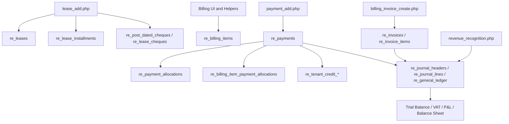

# ERP Real Estate Accounting Transformation - Phase 0 Audit

Version: 1.0

Status: Phase 0 analysis only. No code implementation. No database changes. No historical data changes.

## Executive Summary

The Real Estate module already contains important accounting building blocks: lease schedules, cheque schedules, billing items, invoices, payments, allocation helpers, tenant credit, a Real Estate-specific double-entry GL, deferred revenue recognition, tenant statements, VAT reports, and bank reconciliation screens.

The main architectural issue is that the operational layer is still centered around lease installments and cheques. In practice, installments and cheque counts often become the accounting period driver. This conflicts with the approved future philosophy:

```text
Invoices + Receipts + Allocations = Accounting
Cheques = Payment instruments only
```

The correct transformation path is incremental:

1. Preserve all existing production data and workflows.
2. Keep existing leases in Legacy Mode.
3. Introduce an additive obligation layer for new leases or renewals.
4. Move accounting behavior toward monthly obligations, invoices, cleared receipts, allocations, and GL postings.
5. Validate reports before expanding beyond a pilot.

No historical lease, cheque, payment, journal, invoice, tenant balance, or report should be recalculated, deleted, or reposted automatically.

## High-Level Current Architecture



## 1. Current Lease Creation Flow

### Files Involved

- `modules/realestate/lease_add.php`
- `modules/realestate/includes/lease_schedule_engine.php`
- `modules/realestate/includes/lease_installment_schedule.php`
- `modules/realestate/includes/lease_installments_generate.php`
- `modules/realestate/includes/lease_lifecycle_guard.php`
- `modules/realestate/includes/lease_vat_calculator.php`
- `modules/realestate/includes/payment_allocation_helper.php`
- `modules/realestate/includes/contract_pdf_generator.php`

### Tables Involved

- `re_leases`
- `re_lease_units`
- `re_lease_installments`
- `re_units`
- `re_buildings`
- `re_tenants`
- `re_post_dated_cheques`
- `re_lease_cheques`
- `re_rent_recognition_schedule`
- `re_journal_headers`
- `re_journal_lines`
- `re_general_ledger`

### Current Behavior

Lease creation and editing are handled mainly by `lease_add.php`.

The current flow is:

```text
User saves lease
-> lease record is inserted/updated
-> lease installment plan is calculated
-> re_lease_installments rows are created/reconciled
-> if payment method is cheque, cheque rows are created or synchronized
-> security deposit may be posted to accounting
-> deferred recognition schedule may be seeded
```

The schedule engine already centralizes much of the lease math and lock detection. Existing logic protects paid, partially paid, allocated, invoiced, and cleared cheque-related records from unsafe changes.

The lease flow supports residential and commercial leases, multiple units, renewals, amendments, extra fees, VAT behavior, and flexible schedule structures. However, the saved lease schedule is still operationally installment-centric.

### What Can Be Reused

- Existing lease lifecycle and validation.
- Existing lease schedule calculation and lock-safety logic.
- Existing multi-unit lease support.
- Existing VAT calculation helper.
- Existing lease renewal/amendment workflows.
- Existing guardrails around paid and cleared records.

### What Is Risky

- `lease_add.php` is a large, mixed responsibility file. It handles lease persistence, installments, cheques, deposits, recognition seeding, and some accounting triggers.
- Installments currently act as both operational schedule and implicit accounting obligations.
- Lease saves can create cheque schedules, which reinforces cheque-driven accounting behavior.
- Security deposit posting can occur on lease save, which may not represent actual cleared cash.

### What Must Not Be Touched

- Historical `re_leases` rows.
- Historical `re_lease_installments` rows.
- Historical cheque rows.
- Existing locked installment behavior.
- Existing paid/partial/cleared/installment allocation protections.
- Existing lease status transitions and renewal records.

### Fit With Future Obligation/Invoice Model

The lease engine should remain operational. It should produce source facts: lease term, rent, units, VAT treatment, fees, and deposit expectations. A new obligation engine should derive monthly rent obligations from those facts for Invoice Mode leases.

Existing lease installments can remain as legacy operational schedules. New obligations should not replace them immediately. Instead, obligations should reference the source lease and optionally source installment or billing item during transition.

## 2. Current Cheque Schedule and Collection Flow

### Files Involved

- `modules/realestate/lease_add.php`
- `modules/realestate/lease_view.php`
- `modules/realestate/billing_cheques.php`
- `modules/realestate/billing_cheque_view.php`
- `modules/realestate/billing_cheque_add.php`
- `modules/realestate/includes/lease_installment_schedule.php`
- `modules/realestate/includes/payment_allocation_helper.php`
- `modules/realestate/includes/cheque_legal_helper.php`

### Tables Involved

- `re_post_dated_cheques`
- `re_lease_cheques`
- `re_lease_installments`
- `re_payments`
- `re_payment_allocations`
- `re_billing_items`
- `re_legal_cheque_escalations`

### Current Behavior

When a cheque-based lease is created, the system creates cheque records tied to installments. Cheque records include cheque numbers, dates, amounts, bank details, and statuses.

The current cheque status process supports operational states such as pending, deposited, cleared, bounced, hold, cancelled, returned, and legal escalation behavior.

When cheques are cleared through cheque screens, the system can create payment records and update related installment status. The cheque is still heavily connected to the installment schedule.

### What Can Be Reused

- Cheque tracking UI and status workflow.
- Cheque legal escalation and notification workflow.
- Existing bounced cheque penalty rules.
- Existing status badges and operational controls.
- Existing cheque schedule display in lease view.

### What Is Risky

- Cheques are currently too closely tied to accounting periods.
- Cheque clearing may create a payment operationally without consistently producing the intended GL receipt flow.
- Unequal cheques can distort accounting if cheque periods are treated as revenue periods.
- Replacements, bounced cheques, bank transfers, and cash settlements can create mismatches if cheque records remain the accounting driver.

### What Must Not Be Touched

- Historical cheque statuses.
- Historical cheque numbers, dates, and amounts.
- Cleared cheque records.
- Cheques linked to payments or allocations.
- Legal escalation records.

### Fit With Future Obligation/Invoice Model

Cheques should become payment instruments only. They should represent expected or held payment methods. Clearing a cheque should create or confirm a receipt, and that receipt should allocate against obligations or invoices. Cheque count and cheque date should not determine revenue recognition periods.

## 3. Current Payment / Receipt Flow

### Files Involved

- `modules/realestate/payment_add.php`
- `modules/realestate/payments.php`
- `modules/realestate/payment_view.php`
- `modules/realestate/payment_edit.php`
- `modules/realestate/payment_receipt.php`
- `modules/realestate/lease_payments_manage.php`
- `modules/realestate/billing_cheque_view.php`
- `modules/realestate/cash_payment_requests.php`
- `modules/realestate/cash_verification.php`
- `modules/realestate/includes/cash_payment_helper.php`
- `modules/realestate/accounting/accounting_integration.php`

### Tables Involved

- `re_payments`
- `re_payment_allocations`
- `re_billing_item_payment_allocations`
- `re_tenant_credit_balances`
- `re_tenant_credit_transactions`
- `re_cash_payment_requests`
- `re_cashier_sessions`
- `re_cash_receipt_sequences`
- `re_invoices`
- `re_invoice_items`
- `re_journal_headers`
- `re_journal_lines`
- `re_general_ledger`

### Current Behavior

`payment_add.php` is the main payment/receipt workflow. Payments can be linked to leases, installments, billing items, invoices, bank accounts, cheque references, and tenant credit.

The system supports:

- Manual receipt entry.
- Split allocations to rent installments.
- Split allocations to billing items.
- Overpayment to tenant credit.
- Applying tenant credit.
- Receipt display through `payment_receipt.php`.
- Accounting posting after payment save.

There is not yet a fully independent receipt engine. `re_payments` acts as the receipt header.

### What Can Be Reused

- `re_payments` as the current receipt/payment header.
- `payment_receipt.php` presentation.
- Cash receipt sequence pattern from the cash workflow.
- Existing bank/cash payment method handling.
- Existing payment edit/reversal patterns.
- Existing tenant credit behavior.

### What Is Risky

- Receipt numbering is not fully standardized across all payment types.
- Some receipt numbers are manually entered.
- Some cheque clearing paths can create payments outside the full allocation/accounting flow.
- Payment posting is non-blocking in several places, meaning operational data may save even if GL posting fails.
- Invoice-linked payments and allocation-linked payments are not fully unified.

### What Must Not Be Touched

- Historical `re_payments` records.
- Historical receipt numbers.
- Payment allocations.
- Tenant credit balances and transactions.
- Cash payment verification history.
- Existing payment reversal behavior.

### Fit With Future Obligation/Invoice Model

The future Receipt Engine should build on `re_payments`, not replace it immediately. Receipts should be created only when funds clear. The receipt should then allocate against obligations or invoice lines using a unified allocation engine.

## 4. Current Allocation Logic

### Files Involved

- `modules/realestate/includes/payment_allocation_helper.php`
- `modules/realestate/payment_add.php`
- `modules/realestate/lease_payments_manage.php`
- `modules/realestate/ajax_get_installments.php`
- `modules/realestate/lease_view.php`
- `modules/realestate/tenant_portal/payments.php` indirectly through helper usage

### Tables Involved

- `re_payment_allocations`
- `re_billing_item_payment_allocations`
- `re_lease_installments`
- `re_billing_items`
- `re_payments`
- `re_tenant_credit_balances`
- `re_tenant_credit_transactions`
- `re_post_dated_cheques`

### Current Behavior

Allocation logic is one of the most mature parts of the current system.

It supports:

- Payment allocation to multiple rent installments.
- Payment allocation to multiple billing items.
- Partial payments.
- Overpayments.
- Tenant credits.
- Applying tenant credits.
- Updating installment and billing item paid statuses.
- Avoiding double-counting between modern allocations and legacy links.

The allocation layer is still target-specific: installments and billing items are separate allocation targets. There is no single `obligation_id` target yet.

### What Can Be Reused

- Paid-total calculations.
- Partial payment logic.
- Tenant credit logic.
- Allocation status updates.
- PDC sync after installment payment.
- Allocation UI concepts.

### What Is Risky

- Legacy direct links and modern allocation rows coexist.
- Invoice payments can update invoice outstanding without detailed invoice-line allocation.
- Reports use different balance sources: installments, billing items, invoices, tenant ledgers, and GL.
- Cross-lease allocation policies are not clearly formalized.

### What Must Not Be Touched

- Existing allocation rows.
- Existing legacy direct installment/payment links.
- Existing tenant credit history.
- Existing paid/partial status calculation behavior.

### Fit With Future Obligation/Invoice Model

The helper should become the basis of a future Allocation Engine. The target should evolve from `installment_id` and `billing_item_id` into obligation-level allocation, while preserving compatibility with historical allocation rows.

## 5. Current Billing Items / Penalties Logic

### Files Involved

- `modules/realestate/billing.php`
- `modules/realestate/billing_items.php`
- `modules/realestate/billing_item_add.php`
- `modules/realestate/billing_service_charges.php`
- `modules/realestate/billing_penalties.php`
- `modules/realestate/billing_invoice_create.php`
- `modules/realestate/includes/billing_helper.php`
- `modules/realestate/cron_lease_penalties.php`
- `modules/realestate/lease_view.php`

### Tables Involved

- `re_billing_items`
- `re_service_charge_types`
- `re_service_charges`
- `re_penalty_rules`
- `re_billing_item_payment_allocations`
- `re_invoices`
- `re_invoice_items`
- `re_invoice_sequences`

### Current Behavior

Billing items currently represent service charges, penalties, parking fees, and other non-rent charges. Penalty rules can generate billing items, including bounced cheque penalties and late payment penalties.

Service billing has its own schedules and can create billing items independent of rent installments. This aligns with the approved blueprint that services should remain separate from leases.

Invoices can be created manually from billing items, and billing items can be paid through payment allocations.

### What Can Be Reused

- `re_billing_items` as a strong source for service obligations during transition.
- Penalty rules and idempotent penalty creation.
- Service charge schedule generation.
- Invoice creation from billing items.
- Billing item allocation behavior.

### What Is Risky

- Service items can be paid and posted without first being invoiced.
- VAT treatment is not consistently automated for all service schedules.
- Penalty accrual and waiver rules need accountant approval controls before becoming part of a strict obligation model.
- Billing item status and invoice status can drift if invoice and allocation paths are not unified.

### What Must Not Be Touched

- Existing billing items.
- Existing penalty items.
- Existing penalty waivers.
- Existing service charge schedules.
- Existing invoice links.

### Fit With Future Obligation/Invoice Model

Billing items should become service obligation sources. The future obligation layer can reference `re_billing_items` using `source_type = 'billing_item'`. Service billing should continue to be separate from lease rent and should feed obligations/invoices independently.

## 6. Current Security Deposit Posting Logic

### Files Involved

- `modules/realestate/lease_add.php`
- `modules/realestate/accounting/accounting_integration.php`
- `modules/realestate/move_out.php`
- `modules/realestate/move_out_view.php`
- `modules/realestate/includes/lease_termination_helper.php`

### Tables Involved

- `re_leases`
- `re_lease_installments`
- `re_payments`
- `re_move_outs`
- `re_tenant_refunds`
- `re_journal_headers`
- `re_journal_lines`
- `re_general_ledger`
- `re_chart_of_accounts`

### Current Behavior

Security deposits are stored on lease records and may be represented in installments or separate payment rows depending on lease setup.

`lease_add.php` calls `post_security_deposit_to_accounting()` for new leases with security deposits. The accounting integration posts the deposit to a liability account, typically security deposits payable.

Move-out and refund flows can call `post_deposit_refund_to_accounting()` to refund deposits or account for deductions.

### What Can Be Reused

- Existing liability account pattern.
- Existing deposit refund function.
- Existing move-out inspection/refund workflow.
- Existing tenant refund posting functions.

### What Is Risky

- Deposit posting on lease creation may occur before funds actually clear.
- The source bank/cash account may not reflect the true collection method if the deposit is paid later.
- Historical deposits may have inconsistent posting timing.
- Deposit deductions need clear accountant approval and audit controls.

### What Must Not Be Touched

- Historical deposit journal entries.
- Historical move-out refunds and deductions.
- Existing tenant refund records.
- Existing security deposit values on leases.

### Fit With Future Obligation/Invoice Model

Security deposits should be treated as liability obligations, not revenue. In Invoice Mode, deposit expectation can be an obligation, but GL liability should be posted when receipt clears, unless the business explicitly approves another accounting treatment.

## 7. Current Revenue Recognition Logic

### Files Involved

- `modules/realestate/accounting/revenue_recognition.php`
- `modules/realestate/accounting/accounting_integration.php`
- `modules/realestate/includes/lease_installment_schedule.php`
- `modules/realestate/lease_add.php`

### Tables Involved

- `re_rent_recognition_schedule`
- `re_leases`
- `re_lease_installments`
- `re_payments`
- `re_journal_headers`
- `re_journal_lines`
- `re_general_ledger`

### Current Behavior

Revenue recognition currently works mainly for leases using deferred revenue mode.

The typical deferred flow is:

```text
Payment received
-> Dr Bank/Cash
-> Cr Deferred Rent Revenue
-> recognition schedule rows linked to payment
-> revenue recognition run
-> Dr Deferred Rent Revenue
-> Cr Rent Income
```

Recognition schedule seeding exists, but recognition rows generally depend on deferred payment links. This is not yet the same as the approved monthly revenue recognition policy that recognizes rent monthly regardless of cheque count or collection timing.

### What Can Be Reused

- `re_rent_recognition_schedule` as a starting point.
- `process_revenue_recognition()` idempotent recognition pattern.
- Existing deferred revenue account handling.
- Existing period lock and journal duplicate protections.

### What Is Risky

- Recognition is not yet obligation-driven.
- Recognition dates can follow installment dates instead of true monthly periods.
- Recognition may depend on payments in deferred mode.
- Standard leases may not follow deferred/monthly recognition at all.
- Commercial VAT handling must be separated from collection timing.

### What Must Not Be Touched

- Existing recognition schedule rows.
- Existing recognition journals.
- Existing deferred payment links.
- Existing leases using deferred mode.

### Fit With Future Obligation/Invoice Model

The future Recognition Engine should use monthly obligations as the driver. Rent revenue should be recognized monthly based on lease term and obligation period, independent of cheque count, cheque value, or cheque clearance.

Residential rent obligations should be VAT exempt. Commercial rent obligations should carry VAT at the configured rate.

## 8. Current GL Posting Entry Points

### Files Involved

- `modules/realestate/accounting/accounting_engine.php`
- `modules/realestate/accounting/accounting_integration.php`
- `modules/realestate/lease_add.php`
- `modules/realestate/billing_invoice_create.php`
- `modules/realestate/payment_add.php`
- `modules/realestate/lease_payments_manage.php`
- `modules/realestate/lease_view.php`
- `modules/realestate/move_out_view.php`
- `modules/realestate/accounting/journal_entry_add.php`
- `modules/realestate/accounting/credit_note_add.php`
- `modules/realestate/accounting/bill_entry_add.php`
- `modules/realestate/accounting/vendor_bills.php`
- `modules/realestate/accounting/recurring_journals.php`
- `modules/realestate/accounting/migrate_existing_data.php`
- `modules/realestate/includes/cash_payment_helper.php`
- `modules/realestate/cash_verification.php`

### Tables Involved

- `re_chart_of_accounts`
- `re_journal_headers`
- `re_journal_lines`
- `re_general_ledger`
- `re_account_ledgers`
- `re_account_ledger_entries`
- `re_accounting_postings`
- `re_accounting_audit_log`
- `re_fiscal_years`
- `re_journal_sequences`

### Current Behavior

The accounting engine supports journal creation, posting, reversal, duplicate checks, period locks, GL lines, and sub-ledger updates.

Main posting functions include:

- `post_invoice_to_accounting()`
- `post_payment_to_accounting()`
- `post_payment_with_billing_allocations_to_accounting()`
- `post_deferred_payment_to_accounting()`
- `post_security_deposit_to_accounting()`
- `post_deposit_refund_to_accounting()`
- `post_refund_to_accounting()`
- `post_credit_note_to_accounting()`
- `post_vendor_bill_to_accounting()`
- `process_revenue_recognition()`
- `cash_payment_post_accounting_entry()`

Many operational workflows save first and treat GL posting as non-blocking, showing warnings if posting fails.

### What Can Be Reused

- Double-entry journal engine.
- Period lock logic.
- Duplicate prevention.
- Journal reversal pattern.
- Tenant/vendor sub-ledger pattern.
- Existing account codes and chart of accounts.

### What Is Risky

- Non-blocking posting can create differences between operations and GL.
- Several posting paths exist for similar economic events.
- Some service/payment flows can credit income directly without formal invoice-first AR.
- Migration/backfill tooling exists and must not be run casually.

### What Must Not Be Touched

- Posted journals.
- GL lines.
- Accounting sequences.
- Fiscal year/period locks.
- Historical account ledgers.
- Historical posting audit records.

### Fit With Future Obligation/Invoice Model

The GL engine should remain the accounting foundation. The future model should reduce posting entry-point fragmentation by routing Invoice Mode events through a controlled sequence:

```text
Obligation -> Invoice -> Receipt -> Allocation -> GL
```

Existing legacy posting paths should remain for historical and Legacy Mode behavior.

## 9. Current Bank Reconciliation Flow

### Files Involved

- `modules/realestate/accounting/bank_reconciliation.php`
- `modules/realestate/accounting/bank_reconciliation_match.php`
- `modules/realestate/accounting/ajax_reconcile_transactions.php`
- `modules/realestate/accounting/ajax_unreconcile_transactions.php`
- `modules/realestate/accounting/accounting_engine.php`

### Tables Involved

- `re_bank_accounts`
- `re_chart_of_accounts`
- `re_general_ledger`
- `re_journal_headers`

### Current Behavior

The Real Estate bank reconciliation screen uses GL bank account lines as the book-side transactions. Users can import CSV/Excel statements into the match screen. The matcher scores possible matches by amount, date proximity, and reference similarity.

Match results are stored in session for review. Confirmed reconciliations update `re_general_ledger.is_reconciled`, `reconciled_at`, and `reconciled_by`.

### What Can Be Reused

- Existing bank account master.
- Existing GL bank lines.
- Existing `is_reconciled` fields.
- Existing import parsing and match scoring idea.
- Existing reconcile/unreconcile AJAX actions.

### What Is Risky

- Imported bank statement lines are not persisted as formal records.
- Match records are not stored as an auditable object.
- There is no strong split match, partial match, adjustment, ignore, investigate, or period lock workflow.
- Session-based matching can be lost.
- Reconciliation is weaker than the target Zoho/Xero-style model.

### What Must Not Be Touched

- Existing reconciled GL flags.
- Historical reconciled dates/users.
- Existing bank accounts and GL transactions.

### Fit With Future Obligation/Invoice Model

Bank reconciliation should become a separate persisted workflow:

```text
Imported statement line
-> suggested match to ERP receipt/payment/GL line
-> accountant confirmation
-> persisted match/audit trail
-> reconciled status
```

Receipts created from cleared bank transfers should be matched to bank statement lines. Cheques should only become receipts after clearance.

## 10. Current Reports Affected

### 10.1 Trial Balance

#### Files Involved

- `modules/realestate/accounting/trial_balance.php`
- `modules/realestate/accounting/accounting_engine.php`

#### Tables Involved

- `re_chart_of_accounts`
- `re_general_ledger`

#### Current Behavior

Trial Balance computes balances directly from `re_general_ledger` aggregates up to an as-of date. It uses normal account balance rules:

```text
Debit-normal accounts: SUM(debit) - SUM(credit)
Credit-normal accounts: SUM(credit) - SUM(debit)
```

This is a GL-based report and is one of the more reliable accounting reports if all postings are correct.

#### What Can Be Reused

- Existing GL aggregation logic.
- Existing normal-balance handling.
- Existing export functionality.

#### What Is Risky

- Trial Balance only reflects transactions that reached GL.
- If operational records saved but GL posting failed, Trial Balance will not match operations.
- Legacy payments/cheques not posted to GL remain outside the accounting report.

#### What Must Not Be Touched

- Existing Trial Balance formula.
- Existing GL source table.
- Historical GL balances.

#### Fit With Future Model

Trial Balance should remain GL-based. The transformation must ensure obligations, invoices, receipts, allocations, and recognition produce consistent GL postings before reports are trusted.

### 10.2 AR Aging / Outstanding Balances

#### Files Involved

- `modules/realestate/accounting/outstandings_report.php`
- `modules/realestate/accounting/tenant_statement.php`
- `modules/realestate/collections.php`
- `modules/realestate/reports_outstanding_balances.php`

#### Tables Involved

- `re_invoices`
- `re_payments`
- `re_leases`
- `re_tenants`
- `re_lease_installments`
- `re_billing_items`
- `re_account_ledgers`
- `re_account_ledger_entries`

#### Current Behavior

There are multiple AR definitions:

- Accounting outstandings use `re_invoices.outstanding_amount`.
- Tenant statement uses invoices and payments.
- Collections screens can use installments, billing items, invoices, and bounced cheques.
- Some operational reports use `re_lease_installments.status` or `paid` fields.

This means AR Aging can differ depending on which screen is used.

#### What Can Be Reused

- Existing invoice outstanding fields.
- Existing tenant statement interface.
- Existing collections screens.
- Existing tenant sub-ledger tables.
- Existing allocation helpers.

#### What Is Risky

- AR Aging is not yet obligation/allocation authoritative.
- Invoice outstanding, installment outstanding, billing item outstanding, tenant sub-ledger, and GL AR can drift.
- Tenant portal and management reports may use different balance definitions.

#### What Must Not Be Touched

- Historical invoice outstanding values.
- Historical payment records.
- Existing tenant statement output until replacement is validated.
- Collections workflows used by finance.

#### Fit With Future Model

Future AR Aging should be obligation/invoice/allocation driven with a reconciliation diagnostic against GL AR. The system should expose differences rather than auto-correct historical data.

### 10.3 VAT Report

#### Files Involved

- `modules/realestate/accounting/vat_report.php`
- `modules/realestate/accounting/vat_config.php`
- `modules/realestate/includes/lease_vat_calculator.php`
- `modules/realestate/billing_invoice_create.php`
- `modules/realestate/accounting/accounting_integration.php`

#### Tables Involved

- `re_vat_config`
- `re_chart_of_accounts`
- `re_general_ledger`
- `re_journal_headers`
- `re_invoices`
- `re_invoice_items`
- `re_lease_installments`
- `re_billing_items`

#### Current Behavior

The VAT report reads GL lines for output VAT account `2310` and input VAT account `2320`.

Output VAT is calculated from credit amounts on account `2310`.

Input VAT is currently summed from credit amounts on account `2320`, which may be risky because input VAT is normally debit-driven in many accounting setups.

Lease VAT and billing item VAT exist, but they do not yet form a single obligation/invoice tax model.

#### What Can Be Reused

- VAT configuration table.
- VAT account setup.
- GL-based VAT reporting approach.
- Lease VAT calculator.
- Invoice line tax amounts.

#### What Is Risky

- Input VAT direction may be incorrect depending on actual posting entries.
- Rent VAT can be embedded in installments rather than consistently represented as invoice tax lines.
- Service VAT is not always automatic.
- Residential VAT exemption and commercial VAT treatment must be explicit in the future model.

#### What Must Not Be Touched

- Historical VAT GL entries.
- Historical invoices and invoice tax lines.
- Existing VAT report until a validated replacement is available.

#### Fit With Future Model

VAT should be obligation/invoice-line driven, with residential rent exempt and commercial rent taxable. The VAT report should ultimately reconcile invoice tax, receipt timing where relevant, and GL VAT accounts.

### 10.4 Tenant Statement

#### Files Involved

- `modules/realestate/accounting/tenant_statement.php`
- `modules/realestate/payment_receipt.php`
- `tenant_portal/payments.php`
- `modules/realestate/lease_view.php`

#### Tables Involved

- `re_tenants`
- `re_leases`
- `re_invoices`
- `re_payments`
- `re_account_ledgers`
- `re_account_ledger_entries`
- `re_lease_installments`
- `re_billing_items`
- `re_tenant_credit_balances`
- `re_tenant_credit_transactions`

#### Current Behavior

Tenant Statement currently lists invoices and payments and calculates outstanding balances from invoice outstanding amounts. Other tenant-facing views may also show installments, penalties, service charges, and payments separately.

There is not yet a single authoritative chronological statement combining all obligations, invoices, receipts, allocations, tenant credits, and balances.

#### What Can Be Reused

- Existing tenant statement UI.
- Existing invoice/payment query patterns.
- Tenant sub-ledger entries.
- Tenant credit blocks.
- Payment receipt display.

#### What Is Risky

- Tenant Statement may not match lease view or portal outstanding amounts.
- It can omit un-invoiced obligations if those obligations are still in installments or billing items.
- Tenant sub-ledger exists but is not the sole statement source.

#### What Must Not Be Touched

- Existing statements used by finance.
- Existing tenant payment and invoice history.
- Existing tenant credit history.

#### Fit With Future Model

Tenant Statement should eventually be obligation/invoice/receipt/allocation based, showing a chronological running balance. During transition, it should clearly label legacy balances and invoice-mode balances.

### 10.5 Revenue Report

#### Files Involved

- `modules/realestate/accounting/revenue_recognition.php`
- `modules/realestate/accounting/profit_loss.php`
- `modules/realestate/reports_rent_collection.php`
- `modules/realestate/reports_rent_roll.php`
- `modules/realestate/accounting/accounting_integration.php`

#### Tables Involved

- `re_general_ledger`
- `re_chart_of_accounts`
- `re_rent_recognition_schedule`
- `re_payments`
- `re_lease_installments`
- `re_leases`
- `re_invoices`
- `re_invoice_items`

#### Current Behavior

Revenue is viewed through multiple lenses:

- P&L reads GL income accounts.
- Revenue recognition uses deferred schedule rows.
- Rent collection report reads actual payments.
- Rent roll reads lease monthly rent, payments, and installment due/outstanding data.

These are not the same concept:

- Collection is cash.
- Rent roll is operational expectation.
- Revenue recognition is accounting income.
- P&L is posted GL income.

The future blueprint requires monthly revenue recognition regardless of cheque count or cash collection.

#### What Can Be Reused

- P&L GL-based report.
- Recognition schedule and posting pattern.
- Rent roll operational portfolio view.
- Rent collection cash view.

#### What Is Risky

- Management may read cash collection as revenue.
- Deferred mode is optional and not universal.
- Installment dates and cheque dates can distort revenue timing if used as revenue periods.
- Existing rent roll has company filtering weaknesses and installment-centric outstanding logic.

#### What Must Not Be Touched

- Historical recognized revenue journals.
- Existing rent collection reports used operationally.
- Existing P&L GL logic.

#### Fit With Future Model

Future revenue reports should clearly separate:

- Contracted rent.
- Monthly recognized rent revenue.
- Invoiced AR.
- Collected cash.
- Outstanding obligations.

The GL P&L should remain authoritative for accounting income after obligation-driven recognition is introduced.

## Cross-Cutting Risks

1. Multiple sources of truth exist for tenant balances: installments, billing items, invoices, allocations, tenant credit, tenant sub-ledger, and GL AR.
2. Cheques are operationally useful but should not drive accounting periods.
3. Non-blocking GL posting can cause operational/accounting drift.
4. Historical migration tools exist and must not be run without explicit approval.
5. Legacy direct links and modern allocation tables coexist.
6. Reports can disagree because they use different source tables.
7. Security deposit timing may not match actual fund clearance.
8. VAT treatment is not yet uniformly obligation/invoice-line based.
9. Bank reconciliation lacks persistent statement lines and match audit objects.
10. A direct replacement of existing logic would be high-risk. The correct route is additive and mode-based.

## Production Safety Boundaries

The following must not be changed during Phase 1 without explicit approval:

- Historical leases.
- Historical installments.
- Historical cheques.
- Historical invoices.
- Historical payments.
- Historical allocations.
- Historical tenant credits.
- Historical journals.
- Historical VAT records.
- Historical recognition schedules.
- Historical bank reconciliation flags.
- Existing operational workflows for lease creation, cheque management, payment entry, billing, and collections.

## Recommended Phase 1 Starting Point

Phase 1 should be additive and diagnostic only:

1. Add a feature flag/accounting mode design, defaulting all existing leases to Legacy Mode.
2. Design an additive `re_obligations` schema.
3. Build a read-only obligation preview for one lease.
4. Compare previewed obligations against current installments and billing items.
5. Add no automatic postings.
6. Generate no historical invoices.
7. Repost no historical journals.
8. Convert no historical lease automatically.

## Phase 0 Conclusion

The current system can support the transformation, but only if the existing components are preserved and gradually connected through a new obligation/invoice/receipt/allocation layer.

The strongest reusable components are:

- Lease schedule engine and lock guards.
- Billing items and penalty helpers.
- Payment allocation helper.
- Tenant credit logic.
- Real Estate accounting engine.
- Accounting integration posting functions.
- Revenue recognition schedule pattern.
- Existing GL-based Trial Balance, P&L, and VAT report foundations.

The biggest design priority for Phase 1 is to create a safe obligation layer beside existing data, not inside or on top of destructive changes.

Stop point: Phase 0 audit complete. No Phase 1 implementation should begin without approval.
