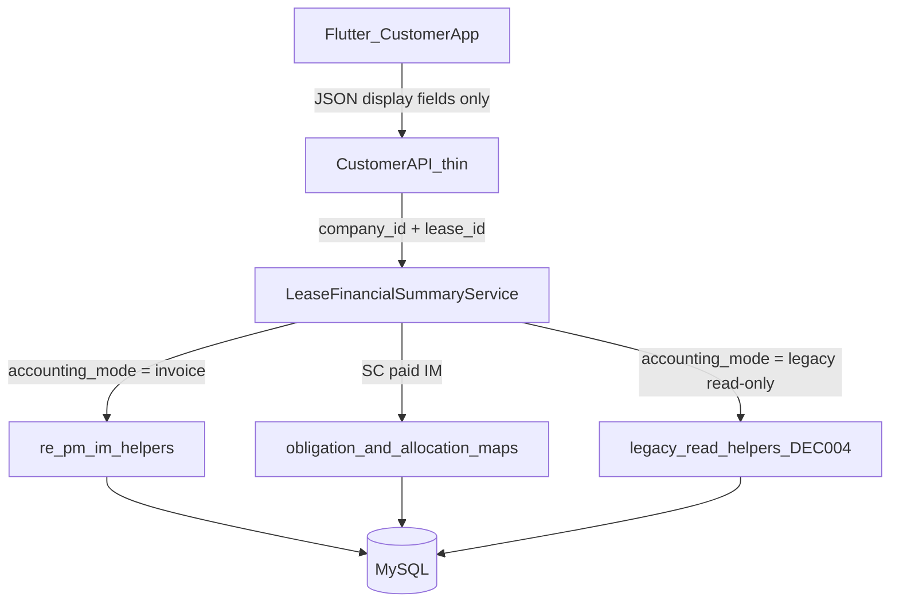

# Customer App Financial Synchronization — Implementation Roadmap

| Field | Value |
|-------|-------|
| Status | **Draft roadmap — Phase 1+ implementation blocked until explicit approval** |
| Document type | Official implementation roadmap |
| Created | 2026-07-30 |
| Related audit | Customer App ↔ ERP Compatibility Audit (Phase 1 audit approved) |
| Related decisions | DEC-003 (Invoice Mode official), DEC-004 (Legacy historical only) |
| Active scope | ERP Financial Service Layer · Customer API (`api/customer/`) · Flutter (`customer_app/`) |
| Explicitly excluded | `tenant_portal/` (retired) · Stay/Guest ARS · posting/schema · cheques (Phase 6) |

---

## 1. Executive Summary

The published Customer App (Long-Term Tenant / “My Home”) currently shows financial figures that do not reliably match the Real Estate ERP. The root cause is architectural, not cosmetic: Customer API D-light finance endpoints still implement **Legacy installment accounts-receivable logic**, while the ERP’s official accounting model is **Invoice Mode** (obligations → invoices → receipts → `re_receipt_allocations`).

This roadmap defines how to restore parity by:

1. Introducing a **centralized Real Estate Lease Financial Service Layer** inside the ERP (single source of truth for read models).
2. Refactoring the **Customer API** into a **thin auth/scoping/serialization layer** that delegates all financial calculations to that service.
3. Refactoring the **Flutter Customer App** so it **displays only server-provided financial values** and never recomputes outstanding, paid, remaining, VAT, or status.

**Success criterion:** For every validated lease, ERP Lease View, ERP Payment Manager, Customer API JSON, and Customer App UI show **identical** financial amounts and display statuses (tolerance **0.01 AED**). No differences are acceptable.

**Non-goal of this document:** Changing production code. This file is Phase 0 planning only. Implementation starts only after explicit approval of this roadmap and then of Phase 1.

---

## 2. Background and History

Customer API Phase D-light tenant finance was originally designed to mirror the retired web Tenant Portal installment-based outstanding queries (sum of `re_lease_installments` by status, Legacy billing-item paid helpers). That cloning preserved Legacy AR semantics inside `api/customer/v1/tenant_endpoints.php`.

Since then, the ERP completed the Invoice Mode program (DEC-003). Official AR for Invoice Mode leases is invoice outstanding and Payment Manager KPIs (`re_pm_im_*`), not installment status sums. The Customer App was not rebased onto that engine, producing the symptoms observed in production (wrong outstanding, paid invoices appearing unpaid, payment/cheque/status drift).

**Note:** The Tenant Portal is **retired** and is **not** part of this project. It must not be inspected, refactored, cleaned up, or used for parity. The sentence above is the only historical reference required.

---

## 3. Current Architecture

### 3.1 Data flow today (broken)

```text
Flutter Customer App
        ↓
Customer API (api/customer/v1/tenant_endpoints.php)
        ↓
Inline SQL + ad-hoc status rules
        ↓
re_lease_installments / re_billing_items / re_payments / re_invoices
```

Problems:

- Financial **business rules live in the API**, not in shared ERP services.
- Outstanding rent ignores Invoice Mode (`accounting_mode`, `re_obligations`, `re_receipt_allocations`).
- Service charges use Legacy `get_billing_item_total_paid` even when IM collections settle via obligations.
- Payments list all `re_payments` without IM receipt filters.
- Flutter sums `outstanding_rent + outstanding_penalties + outstanding_service_charges` client-side.

### 3.2 Endpoints in scope (Customer API finance)

| Method | Route | Current behaviour (summary) |
|--------|-------|-----------------------------|
| GET | `/tenant/dashboard` | Outstanding rent = installment pending/overdue SUM; penalties by billing status; SC via Legacy paid helper |
| GET | `/tenant/leases/{id}/installments` | Raw installment rows + same outstanding SUM |
| GET | `/tenant/leases/{id}/payments` | All `re_payments` for lease; no mode/clearance |
| GET | `/tenant/leases/{id}/penalties` | Gross totals by status |
| GET | `/tenant/leases/{id}/invoices` | Raw invoice columns; no Payment Manager display status |
| GET | `/tenant/leases/{id}/service-charges` | Enrich with Legacy billing paid |
| GET | Documents list (invoice/receipt entries) | Receipt docs hardcode `status: paid` |

Related (non-finance but lease-scoped): `auth/tenant/me` lease list omits `accounting_mode`.

### 3.3 ERP truth (what must be matched)

| Surface | Authoritative read model |
|---------|--------------------------|
| ERP Lease / Tenant views | Invoice Mode summary from `re_invoices` outstanding; obligations open amounts |
| ERP Payment Manager | `re_pm_im_kpis`, `re_pm_im_display_status`, `re_pm_im_invoices_by_class`, `re_pm_im_recent_receipts` in `modules/realestate/includes/lease_payment_manager_im_helper.php` |
| Official reports | Mode-aware patterns in `reporting_mode_helper.php` (`re_report_combined_outstanding`) |

Primary helper file already containing IM read logic:

- [`modules/realestate/includes/lease_payment_manager_im_helper.php`](../modules/realestate/includes/lease_payment_manager_im_helper.php)
- [`modules/realestate/includes/receipt_allocation_engine.php`](../modules/realestate/includes/receipt_allocation_engine.php) (`re_billing_item_obligation_allocated_map`)
- [`modules/realestate/includes/payment_allocation_helper.php`](../modules/realestate/includes/payment_allocation_helper.php) (Legacy installment / billing paid only)

### 3.4 Flutter consumers today

| Area | Path | Issue |
|------|------|-------|
| Models | `customer_app/lib/features/tenant/models/tenant_models.dart` | `totalOutstanding` recomputed from three fields |
| Repository | `customer_app/lib/features/tenant/data/tenant_repository.dart` | Calls fragmented finance endpoints |
| Home / Payments UI | `tenant_home_screen.dart`, `tenant_payments_screen.dart`, status chips | Treat installment status as payment truth |

---

## 4. Target Architecture

### 4.1 Required flow

```text
Flutter Customer App (display only)
        ↓
Customer API (auth, lease scope, envelope, pagination)
        ↓
ERP Lease Financial Summary Service (canonical DTOs)
        ↓
Existing ERP helpers (re_pm_im_*, allocation maps, Legacy read helpers)
        ↓
Database
```

### 4.2 Diagram



### 4.3 Future clients (out of this implementation)

Owner Portal, public website, WhatsApp AI, and AI Assistant **must** eventually call the same ERP service (or thin APIs that wrap it). They are **not** delivered in Phases 1–5. Designing a stable DTO now is how this project stays future-proof.

### 4.4 Anti-patterns (forbidden going forward)

- Embedding `SUM(amount) FROM re_lease_installments WHERE status IN ('pending','overdue')` as accounting outstanding in Customer API.
- Flutter summing or deriving paid/outstanding/VAT/status.
- Duplicating Payment Manager KPI SQL inside API handlers.
- Using Legacy `re_billing_item_payment_allocations` as IM service-charge collection truth.
- Treating operational installments or cheques as Invoice Mode AR.

---

## 5. Root Cause Analysis

| Finding ID | Severity | Cause | Effect on app |
|------------|----------|-------|---------------|
| C1 | Critical | Dashboard outstanding rent uses installment status SUM | Wrong balance vs ERP IM |
| C2 | Critical | Installments treated as payment status | Paid invoices still look unpaid |
| C3 | Critical | No `accounting_mode` / obligations / receipt allocations in API | Entire finance surface Legacy-blind |
| C4 | Critical | SC paid via Legacy billing allocations | SC outstanding wrong for IM leases |
| H1 | High | Payments list unfiltered | Draft/uncleared/non-IM rows confuse “payment status” |
| H2 | High | Penalties not allocation-aware | Penalty outstanding wrong |
| H3 | High | Invoice raw status only | Display status ≠ Payment Manager |
| H4 | High | No cheques API | Deferred to Phase 6 (not AR) |
| H5 | High | Flutter recomputes total outstanding | Client invents money totals |
| H6 | High | Documents hardcode receipt `paid` | Misleading document status |
| M1–M5 | Medium | Partial installments, missing mode fields, N+1, weak company_id on SELECT, no obligations exposure | Drift, perf, incomplete summary |

**Single sentence:** The Customer App financial layer was never migrated from Legacy installment AR to the ERP Invoice Mode financial engine.

---

## 6. Design Principles (Non-Negotiable)

1. **ERP Financial Engine is the only source of truth.** No accounting rules, outstanding math, allocation logic, VAT totals, or financial status rules in Customer API or Flutter.
2. **Customer API is a thin service layer.** Auth (JWT), tenant/lease authorization (`X-Tenant-Lease-Id`), company scoping, envelope `{ok,data}`, pagination — not business calculation.
3. **Eliminate duplicated business logic.** Any calculation that exists in ERP helpers must be reused, not copied.
4. **Flutter never calculates financial values.** It renders API fields only.
5. **One reusable Financial Summary model** for all current and future clients.
6. **Business-oriented APIs** (Dashboard Summary, Lease Financial Summary, Outstanding Items, Payment History, Payment Timeline) over raw table dumps.
7. **Future-proof:** clients depend on service contracts, not table shapes or Legacy SQL.
8. **Correctness over legacy API shape** when they conflict (backward-compatible keys allowed as aliases only when equal to canonical values).
9. **DEC-003 / DEC-004:** new work targets Invoice Mode; Legacy path is read-only compatibility for historical leases — do not extend Legacy posting.
10. **Fail closed** on missing `company_id` / `lease_id`.

---

## 7. Refactoring Strategy

### 7.1 Order of work

| Phase | Focus | Code touch? |
|-------|--------|-------------|
| 0 | This roadmap | Docs only |
| 1 | Centralize ERP financial service + DTO | ERP includes only |
| 2 | Thin Customer API on the service | `api/customer/` |
| 3 | Flutter models/screens display-only | `customer_app/` |
| 4 | Parity validation (ERP ↔ API ↔ App) | Tests/QA scripts, no product feature work |
| 5 | Performance, batching, security review | Softening queries; security hardening with separate approval for JWT/CORS |
| 6 (future) | Cheques operational read API/UI | Out of current delivery |

### 7.2 Layer ownership

| Layer | Owns | Must not own |
|-------|------|--------------|
| ERP helpers (`re_pm_im_*`, allocation) | Canonical money math | HTTP / JWT |
| Lease Financial Summary Service | Mode routing, DTO assembly, batching | Auth |
| Customer API | Authz, lease header, JSON envelope | Outstanding formulas |
| Flutter | Presentation | Any money math |

### 7.3 Mode routing (inside the service only)

```text
Load lease (company_id, lease_id) → accounting_mode
  if invoice → IM helpers + obligation maps
  if legacy  → read-only installment remaining + Legacy billing paid
  else       → fail closed / treat as legacy read with explicit mode flag
```

### 7.4 Four layers (must stay distinct in API labels)

| Layer | Examples | Customer App role |
|-------|----------|-------------------|
| Commercial | Lease terms, rent, dates | Display on lease card |
| Operational | Installment schedule, (future) cheques | Schedule UI only; never AR total |
| Accounting | Invoices, obligations, receipts, allocations | Primary finance UI |
| Reporting | KPIs, overdue, due now | Dashboard summary |

---

## 8. ERP Service Reuse Strategy

### 8.1 New module (Phase 1 deliverable)

**Proposed path:** `modules/realestate/includes/lease_financial_summary_service.php`

**Role:** Stable, read-only facade. Prefer composing existing functions over new SQL. New SQL allowed only when no helper exists and only after documenting why (still centralized here, never in API).

**Requires:**

- `lease_payment_manager_im_helper.php`
- `payment_allocation_helper.php`
- `receipt_allocation_engine.php` (for `re_billing_item_obligation_allocated_map`)
- `accounting_mode_helper.php` (normalize mode)
- Security deposit summary helper if deposit fields are included in summary (optional Phase 1b)

### 8.2 Public facade (locked behaviour)

| Function | Purpose | Reuses |
|----------|---------|--------|
| `re_lease_load_financial_context(PDO, companyId, leaseId)` | Fail-closed load: lease row, tenant_id, accounting_mode, currency | Lease SELECT with company_id |
| `re_lease_financial_summary(PDO, companyId, leaseId, tenantId = 0)` | Canonical Financial Summary DTO | IM: `re_pm_im_kpis` + class totals; Legacy: allocation-aware installment remaining |
| `re_lease_outstanding_items(PDO, companyId, leaseId, options)` | Open/due/overdue invoices with `display_status` | `re_pm_im_invoices_by_class`, `re_pm_im_display_status` |
| `re_lease_payment_history(PDO, companyId, leaseId, limit)` | Mode-aware receipts + allocated/unallocated | `re_pm_im_recent_receipts` (IM); Legacy payments filtered appropriately |
| `re_lease_payment_timeline(PDO, companyId, leaseId, limit)` | Merged chronological invoices + receipts for UI | Composition of outstanding items + history |
| `re_lease_schedule_installments(PDO, companyId, leaseId)` | Operational schedule + paid/remaining per row | `get_installment_total_paid` (display only); **must set `layer: operational`** |
| `re_lease_service_charge_rows(PDO, companyId, leaseId)` | SC rows with paid/outstanding/display_status | IM: obligation allocated map (batched); Legacy: `get_billing_item_total_paid` |
| `re_lease_penalty_rows(PDO, companyId, leaseId)` | Penalty rows with paid/outstanding | Same mode split as SC / invoice class |

### 8.3 Service invariants

1. Never write to the database.
2. Always require `company_id > 0` and `lease_id > 0`.
3. Every financial query includes `company_id`.
4. Money fields in API-facing DTOs are strings with 2 decimal places (`"1234.50"`).
5. Internal helper floats may remain float; convert at DTO boundary.
6. Lease-level `display_status` derived only from summary rules (e.g. overdue if `overdue_amount > 0`, else due if `due_now_amount > 0`, else `up_to_date` / `paid`) — implemented **once** in the service.
7. Do not invent maker/checker thresholds or commercial fee policies.

### 8.4 Mapping from Payment Manager to Customer Summary

| Financial Summary field | IM source |
|-------------------------|-----------|
| `outstanding_total` | `re_pm_im_kpis.total_outstanding` |
| `overdue_amount` | `total_overdue` |
| `due_now_amount` | `total_due_now` |
| `invoice_total` | `total_invoiced` |
| `receipts_total` / `paid_total` | `total_collected` (document aliasing carefully) |
| `allocated_total` | `allocated_total` |
| `tenant_credit` | `tenant_credit` |
| `rent_outstanding` | Class totals from `re_pm_im_invoices_by_class` (rent class) |
| `service_charge_outstanding` | SC class / kind totals |
| `penalty_outstanding` | Penalty class totals |
| `vat_total` | Sum invoice VAT if columns/lines available; otherwise `null` + `vat_available: false` (do not invent) |

If a VAT aggregate helper does not exist yet, Phase 1 documents `vat_total` as optional and adds a single service-side query against invoice/line VAT fields — still centralized, not in API.

---

## 9. Financial Response Model

### 9.1 Canonical DTO: `LeaseFinancialSummary`

All amounts are decimal strings unless noted. Currency default `AED`.

```json
{
  "lease_id": 123,
  "company_id": 1,
  "tenant_id": 45,
  "accounting_mode": "invoice",
  "currency": "AED",
  "as_of_date": "2026-07-30",
  "display_status": "overdue",
  "outstanding_total": "1500.00",
  "rent_outstanding": "1000.00",
  "service_charge_outstanding": "400.00",
  "penalty_outstanding": "100.00",
  "overdue_amount": "1500.00",
  "due_now_amount": "1500.00",
  "invoice_total": "12000.00",
  "paid_total": "10500.00",
  "receipts_total": "10500.00",
  "allocated_total": "10500.00",
  "unallocated_receipts": "0.00",
  "vat_total": "571.43",
  "vat_available": true,
  "tenant_credit": "0.00",
  "invoice_count": 12,
  "receipt_count": 10,
  "due_now_count": 2,
  "overdue_count": 2,
  "last_payment": {
    "payment_id": 99,
    "payment_date": "2026-06-01",
    "amount": "1000.00",
    "receipt_number": "R-100",
    "display_status": "cleared"
  },
  "next_due": {
    "kind": "invoice",
    "reference_id": 501,
    "reference_number": "INV-501",
    "due_date": "2026-08-01",
    "amount": "1000.00",
    "display_status": "open"
  }
}
```

### 9.2 Outstanding item

```json
{
  "item_type": "invoice",
  "id": 501,
  "document_number": "INV-501",
  "document_date": "2026-07-01",
  "due_date": "2026-08-01",
  "class": "rent",
  "description": "Rent August 2026",
  "total_amount": "1050.00",
  "paid_amount": "0.00",
  "outstanding_amount": "1050.00",
  "vat_amount": "50.00",
  "status": "sent",
  "display_status": "future"
}
```

`display_status` **must** come from `re_pm_im_display_status` (or service wrapper), not Flutter mapping of raw `status` alone.

### 9.3 Payment / receipt history item

```json
{
  "payment_id": 99,
  "payment_date": "2026-06-01",
  "cleared_date": "2026-06-02",
  "amount": "1000.00",
  "allocated_amount": "1000.00",
  "unallocated_amount": "0.00",
  "payment_method": "bank_transfer",
  "receipt_number": "R-100",
  "reference_number": null,
  "accounting_mode": "invoice",
  "receipt_status": "cleared",
  "allocation_status": "fully_allocated",
  "display_status": "cleared"
}
```

### 9.4 Operational installment (schedule only)

```json
{
  "layer": "operational",
  "id": 10,
  "installment_date": "2026-08-01",
  "amount": "1000.00",
  "paid_amount": "0.00",
  "remaining_amount": "1000.00",
  "status": "pending",
  "notes": null
}
```

API responses that include installments **must** include top-level:

```json
{
  "layer": "operational",
  "warning": "Installment schedule is operational only and is not Invoice Mode accounts receivable."
}
```

### 9.5 Flutter mirroring rule

Every DTO field used in UI has a Dart field of the same meaning. **Forbidden:**

```dart
double get totalOutstanding =>
    outstandingRent + outstandingPenalties + outstandingServiceCharges;
```

**Required:**

```dart
double get totalOutstanding => outstandingTotal; // from API only
```

---

## 10. API Refactoring Plan (Phase 2)

### 10.1 Target business-oriented routes

| Method | Route | Handler responsibility |
|--------|-------|------------------------|
| GET | `/tenant/dashboard` | Lease card + `financial` = `re_lease_financial_summary` (+ lease expiry flag as today) |
| GET | `/tenant/leases/{id}/financial-summary` | Full `LeaseFinancialSummary` DTO |
| GET | `/tenant/leases/{id}/outstanding-items` | `re_lease_outstanding_items` |
| GET | `/tenant/leases/{id}/payment-history` | `re_lease_payment_history` |
| GET | `/tenant/leases/{id}/payment-timeline` | `re_lease_payment_timeline` |
| GET | `/tenant/leases/{id}/invoices` | Thin alias of outstanding/items or invoice list from same service (keep path for app compatibility) |
| GET | `/tenant/leases/{id}/payments` | Thin alias of payment-history |
| GET | `/tenant/leases/{id}/service-charges` | `re_lease_service_charge_rows` + summary fields from DTO |
| GET | `/tenant/leases/{id}/penalties` | `re_lease_penalty_rows` |
| GET | `/tenant/leases/{id}/installments` | `re_lease_schedule_installments` only (operational) |

All lease routes continue to require Tenant Bearer + matching `X-Tenant-Lease-Id` + `customer_api_tenant_assert_lease_allowed`.

### 10.2 Dashboard payload shape (target)

```json
{
  "lease": {
    "lease_id": 123,
    "start_date": "...",
    "end_date": "...",
    "unit_number": "...",
    "building_name": "...",
    "status": "active",
    "accounting_mode": "invoice"
  },
  "financial": { "...LeaseFinancialSummary fields..." },
  "lease_expiry": { "flag": "active", "days_to_end": 200 }
}
```

Deprecate nested inventing of `outstanding_rent` as installment SUM. For one release, if retained as alias, it **must equal** `rent_outstanding` from the service (IM class breakdown), not installment SQL.

### 10.3 Handler pattern (illustrative — not to implement yet)

```php
function customer_api_tenant_handle_dashboard(PDO $conn): void {
    $ctx = customer_api_tenant_require_access($conn);
    $leaseId = customer_api_tenant_require_dashboard_lease($conn, $ctx);
    $companyId = (int)$ctx['company_id'];
    $tenantId = (int)$ctx['tenant_id'];

    $summary = re_lease_financial_summary($conn, $companyId, $leaseId, $tenantId);
    $lease = /* existing lease detail load with accounting_mode */;

    customer_api_send_ok([
        'lease' => /* ... */,
        'financial' => $summary,
        'lease_expiry' => /* existing time-based flag */,
    ]);
}
```

No outstanding SQL remains in this file after Phase 2.

### 10.4 Documents alignment

Invoice/receipt document list entries must use receipt `display_status` / `receipt_status` from the same payment-history rules. Remove hardcoded `'status' => 'paid'`.

### 10.5 Auth / me enhancements

`auth/tenant/me` lease summaries should include `accounting_mode` so Flutter can choose schedule vs invoice primary UX without guessing.

### 10.6 Compatibility policy

| Approach | Decision |
|----------|----------|
| Keep path names used by Flutter | Yes where possible |
| Keep wrong installment outstanding as AR | No |
| Add canonical fields | Yes |
| Alias old keys to correct service values | Yes, temporary, documented |
| Version bump / `financial_schema_version` | Include `financial_schema_version: 2` in summary DTO |

---

## 11. Flutter Refactoring Plan (Phase 3)

### 11.1 Files to change

| File | Change |
|------|--------|
| `lib/features/tenant/models/tenant_models.dart` | Map `LeaseFinancialSummary`; remove client arithmetic for totals |
| `lib/features/tenant/data/tenant_repository.dart` | Prefer financial-summary / updated dashboard; payments/invoices bind to new fields |
| `lib/features/tenant/tenant_home_screen.dart` | Bind to `outstanding_total`, `display_status`, `next_due` |
| `lib/features/tenant/tenant_payments_screen.dart` | Primary: invoices + payment history; installments as “Schedule” section |
| `lib/features/tenant/tenant_invoices_screen.dart` | Use `display_status` from API |
| `lib/features/tenant/widgets/tenant_status_chips.dart` | Prefer server display labels; keep colour maps for known statuses only |

### 11.2 UX principles

1. **Invoice Mode leases:** Home outstanding = `outstanding_total`. Invoice list is primary. Installments secondary labelled “Payment schedule”.
2. **Legacy leases (if any):** Still show schedule, but amounts must come from service Legacy path (remaining = amount − paid), not Flutter math.
3. Never recompute VAT, paid, remaining, or rollup status on device.
4. Offline cache (if any) stores API DTOs as opaque JSON; do not derive fields on read.

### 11.3 Repository strategy

- `fetchDashboard()` returns lease + financial summary.
- `fetchPaymentsBundle()` should call financial-summary + outstanding-items + payment-history (or fewer round-trips if dashboard already embeds summary). Avoid four independent Legacy endpoints that disagree.
- Optional later: single `GET financial-summary` + one timeline call to reduce chatter.

---

## 12. Validation Strategy (Phase 4)

### 12.1 Parity surfaces (only these)

| # | Surface | What to compare |
|---|---------|-----------------|
| 1 | ERP Lease View (IM financial summary / lease outstanding) | outstanding, paid, invoice totals |
| 2 | ERP Payment Manager (`re_pm_im_kpis` / UI KPI strip) | outstanding, overdue, due now, collected |
| 3 | Customer API JSON (`financial` / financial-summary) | Same fields |
| 4 | Customer App UI | Same fields as rendered |

**Excluded:** Tenant Portal and all other portals/channels.

### 12.2 Acceptance rule

For each sampled lease and each field in the comparison set:

```text
abs(ERP_value - API_value) <= 0.01 AED
abs(API_value - App_displayed_value) <= 0.01 AED
display_status string equality (normalized)
```

No differences are acceptable beyond rounding tolerance.

### 12.3 Comparison field set (minimum)

- `accounting_mode`
- `outstanding_total`
- `rent_outstanding`
- `service_charge_outstanding`
- `penalty_outstanding`
- `overdue_amount`
- `due_now_amount`
- `invoice_total`
- `receipts_total` / `paid_total`
- `allocated_total`
- Per open invoice: `outstanding_amount`, `display_status`
- Latest receipt: `amount`, `display_status` / clearance

### 12.4 Sample lease matrix

| Scenario | Why |
|----------|-----|
| IM lease, fully paid | outstanding 0; display up_to_date |
| IM lease, partial invoice paid | partial + remaining match PM |
| IM lease, overdue invoice | overdue_amount match |
| IM lease with service charges settled via receipts | SC outstanding 0 on app |
| IM lease with penalties | penalty breakdown match |
| Multi-lease tenant | Header lease switch does not mix companies/leases |
| Legacy historical lease (if present) | Legacy path remaining matches ERP legacy view |

### 12.5 Evidence capture

For each sample lease, store:

- Payment Manager KPI screenshot or exported numbers
- API JSON response (`financial-summary`)
- App screenshot / debug overlay of bound fields
- Diff checklist signed off by QA

---

## 13. Testing Matrix

| ID | Area | Test | Pass criteria |
|----|------|------|---------------|
| T1 | Service unit | `re_lease_financial_summary` vs `re_pm_im_kpis` for same lease | Exact match within 0.01 |
| T2 | Service unit | SC rows IM paid map vs Payment Manager SC invoices | Outstanding match |
| T3 | Service unit | Legacy lease remaining uses `get_installment_total_paid` | Remaining = amount − paid |
| T4 | API authz | Wrong `X-Tenant-Lease-Id` | 403/404; no data leak |
| T5 | API authz | Cross-company lease id | Denied |
| T6 | API contract | Dashboard `financial.outstanding_total` | Equals service |
| T7 | API contract | Installments response includes `layer: operational` | Present |
| T8 | API contract | Payments exclude incorrect draft/non-mode rows per service rules | Match history helper |
| T9 | Flutter | Outstanding widget uses `outstandingTotal` only | No local sum of three fields |
| T10 | Flutter | Invoice chip uses API `display_status` | Matches JSON |
| T11 | Flutter | Schedule section does not drive home outstanding | Home uses summary |
| T12 | Regression | Stay/Guest ARS endpoints unchanged | Smoke health + quote |
| T13 | Perf | SC list N+1 eliminated | ≤ constant queries per lease |
| T14 | Perf | Unbounded lists capped/paginated | Page size enforced |
| T15 | Parity | Full Phase 4 matrix on sample leases | Zero diffs |

Automated preference: PHP CLI/parity script calling service + comparing to `re_pm_im_kpis` for IM leases; Flutter widget/golden tests for binding only.

---

## 14. Rollback Strategy

This project is **read-model only** (no schema migrations, no posting changes). Rollback is low risk.

| Mechanism | Use when |
|-----------|----------|
| Git revert of `lease_financial_summary_service.php` + API handler commits | Service/API defect |
| Git revert of Flutter finance model commits | App display defect |
| Feature flag `CUSTOMER_API_FINANCIAL_SCHEMA_V2` (optional) | Gradual cutover: v2 path vs old handlers during dual-read window |
| Dual-read compare log (temporary) | Log abs diffs server-side without exposing to clients; remove after Phase 4 |

**Do not** roll back by reintroducing installment SUM as AR.

No database rollback required if Phase 1–5 remain read-only as planned.

---

## 15. Risks

| Risk | Likelihood | Impact | Mitigation |
|------|------------|--------|------------|
| Flutter still depends on old key names | Medium | Medium | Aliases + schema version; coordinated app release |
| `vat_total` fields incomplete in schema | Medium | Low | `vat_available: false` until confirmed columns |
| `re_pm_im_kpis` receipt filter differs from tenant_view `receipt_status=cleared` | Medium | High | Align service to Payment Manager first; document any intentional filter; reconcile with Lease View in Phase 4 |
| Legacy leases still in production | Low–Medium | Medium | Explicit Legacy read path; label mode in API |
| Scope creep into portal / cheques / posting | Medium | High | This document’s exclusions; reject out-of-scope PRs |
| Performance regression from rich summary | Medium | Medium | Phase 5 batching; cache only if measured |
| JWT fallback / CORS `*` remain | Known | Security | Phase 5 + separate security approval |

---

## 16. Performance Plan (Phase 5)

1. Replace per-row `get_billing_item_total_paid` loops with one `re_billing_item_obligation_allocated_map` (IM) or batched allocation query (Legacy).
2. Paginate invoices, payments, installments, SC lists (default page size e.g. 50; max 100).
3. Dashboard: one `re_lease_financial_summary` call — do not load all SC rows solely to sum open amounts.
4. Documents endpoint: reuse payment-history projection instead of a second unbounded payment query when feasible.
5. Add `company_id` to all financial WHERE clauses (defense in depth).
6. Profile before speculative indexes.

---

## 17. Security Review Notes (Phase 5)

| Item | Action |
|------|--------|
| Lease scope | Keep assert_lease_allowed on every finance route |
| Company scope | Enforce in service queries |
| New routes | Same Tenant JWT; no anonymous finance |
| JWT secret fallback | Fail closed when env missing — **human approval** before production cutover |
| CORS `*` | Restrict origins — **human approval** |
| Logging | Never log tokens or passwords |

Skills to run before release: `api-review`, `security-review`, `accounting-review`, `invoice-mode-review`, `code-review`.

---

## 18. Out of Scope (Hard)

- Any file under `tenant_portal/`
- Database migrations / repair / posting / allocation write paths
- Extending Legacy payment posting (DEC-004)
- Stay / Guest / ARS financial stacks
- Cheque APIs and UI (Phase 6 only)
- Owner Portal, website, WhatsApp AI, AI Assistant implementations
- Inventing commercial rules (cheque counts, fee treatments, maker/checker thresholds)

---

## 19. Phase-by-Phase Implementation Checklist

### Phase 0 — Architecture and planning

- [x] Compatibility audit completed and approved
- [x] Architectural principles locked (ERP source of truth; thin API; Flutter display-only)
- [x] Tenant Portal excluded from scope
- [x] This roadmap document created at `docs/CUSTOMER_APP_FINANCIAL_SYNC_IMPLEMENTATION_PLAN.md`
- [ ] **Explicit approval to begin Phase 1**

### Phase 1 — Centralize ERP Financial Service

- [ ] Add `modules/realestate/includes/lease_financial_summary_service.php`
- [ ] Implement context load + mode routing (fail closed)
- [ ] Implement `re_lease_financial_summary` composing `re_pm_im_kpis` / class breakdown
- [ ] Implement outstanding items with `re_pm_im_display_status`
- [ ] Implement payment history via `re_pm_im_recent_receipts` (and Legacy read path)
- [ ] Implement payment timeline composer
- [ ] Implement operational installment schedule helper
- [ ] Implement SC / penalty row helpers with IM obligation map batching
- [ ] Unit/parity checks: service vs Payment Manager KPIs for sample IM leases
- [ ] `accounting-review` + `invoice-mode-review` on the new service
- [ ] **No Customer API / Flutter changes required to close Phase 1**, but service must be callable from a CLI smoke script

### Phase 2 — Refactor Customer API

- [ ] Require financial service from tenant finance handlers
- [ ] Rewrite `GET tenant/dashboard` financial block
- [ ] Add `GET …/financial-summary` (and optionally outstanding-items / payment-timeline)
- [ ] Rewrite invoices, payments, SC, penalties handlers as thin wrappers
- [ ] Rewrite installments as operational schedule only
- [ ] Fix documents receipt status
- [ ] Add `accounting_mode` to lease payloads (`me` / dashboard)
- [ ] Add `financial_schema_version`
- [ ] Remove inline outstanding SUM SQL from `tenant_endpoints.php`
- [ ] `api-review` + `security-review` on changed routes

### Phase 3 — Refactor Flutter Customer App

- [ ] Introduce `LeaseFinancialSummary` model matching DTO
- [ ] Remove client-side outstanding arithmetic
- [ ] Update repository calls
- [ ] Update Home to bind server totals / display_status / next_due
- [ ] Update Payments: invoices + history primary; schedule secondary
- [ ] Update invoice status chips to prefer `display_status`
- [ ] QA on iOS/Android against staging API

### Phase 4 — Validation

- [ ] Build sample lease set (section 12.4)
- [ ] Compare ERP Lease View ↔ Payment Manager ↔ API JSON ↔ Customer App
- [ ] Zero diffs beyond 0.01 AED on comparison field set
- [ ] Sign-off checklist archived
- [ ] Fix any residual mismatches via service (not Flutter math)

### Phase 5 — Performance and security

- [ ] Batch SC paid queries; remove N+1
- [ ] Pagination / caps on list endpoints
- [ ] company_id on financial SELECTs verified
- [ ] Security review of JWT/CORS (separate human approval for production hardening)
- [ ] `performance-review` + `release-readiness` as needed

### Phase 6 — Future (not scheduled)

- [ ] Needs business confirmation: operational cheques read API
- [ ] Flutter cheques UI if confirmed
- [ ] Explicit: cheques remain non-AR

---

## 20. Implementation Approval Gate

| Gate | Required before |
|------|-----------------|
| Approval of **this document** | Phase 1 coding |
| Approval of Phase 1 service PR | Phase 2 API coding |
| Approval of Phase 2 API contract | Phase 3 Flutter release branch |
| Phase 4 parity sign-off | Production Customer App release of finance sync |
| Separate security approval | JWT fail-closed / CORS allowlist production cutover |

Until the first gate is granted, **no production code, database, API, or Flutter changes** are authorized under this roadmap.

---

## 21. Key File Index

| Path | Role in project |
|------|-----------------|
| `docs/CUSTOMER_APP_FINANCIAL_SYNC_IMPLEMENTATION_PLAN.md` | This roadmap |
| `docs/ERP_DECISIONS.md` | DEC-003, DEC-004 |
| `docs/unified_customer_app_mvp_plan_and_api.md` | Legacy MVP contract (to be superseded for finance sections after implementation) |
| `modules/realestate/includes/lease_financial_summary_service.php` | **To create** — central service |
| `modules/realestate/includes/lease_payment_manager_im_helper.php` | Existing IM read helpers |
| `modules/realestate/includes/payment_allocation_helper.php` | Legacy paid helpers |
| `modules/realestate/includes/receipt_allocation_engine.php` | IM billing-item obligation paid map |
| `api/customer/v1/tenant_endpoints.php` | Thin API target |
| `api/customer/v1/tenant_documents_endpoints.php` | Receipt status alignment |
| `api/customer/v1/index.php` | Route registration |
| `customer_app/lib/features/tenant/models/tenant_models.dart` | Display-only models |
| `customer_app/lib/features/tenant/data/tenant_repository.dart` | API client |

---

## 22. Document Control

| Version | Date | Notes |
|---------|------|-------|
| 1.0 | 2026-07-30 | Initial roadmap after audit approval; Tenant Portal fully excluded from scope |

**Next step:** Explicit human approval of this roadmap, then Phase 1 implementation of `lease_financial_summary_service.php` only.
