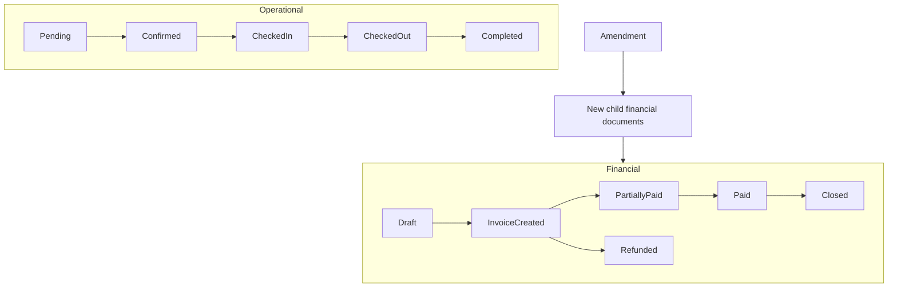
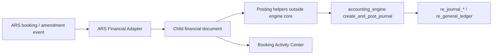

# ARS Holiday Homes — Modernization Audit & Roadmap (Phase 0)

**Status:** Phases 0–3A ✔. Phase 3B **complete** (Wave 0–1 frozen; Milestones 1–5 done). Stay portal **excluded**. Financial Core v1.0 frozen; Adapter **OFF**. Phase 3C/4 not started.  
**Date:** 2026-07-17  
**Scope:** Phase 0 was documentation/investigation. Phase 1–1B added operational hardening, financial lock, and Activity Center only. No `accounting_engine.php` changes; no RE Invoice Mode behaviour changes; Option B Accepted (DEC-016).

**Evidence labels:** Confirmed from code | Confirmed from schema artifact | Strong inference | Needs database confirmation | Needs business confirmation | Not found

---

## 1. Executive summary

ARS is a working short-term rental operations module integrated with Real Estate units and (today) a thin direct-posting bridge into the shared RE ledger. It is **not** yet a complete Holiday Homes Management System with professional dual-lifecycle accounting, amendments, or a unified Booking Activity Center.

**Architecture priorities (Accepted by business — 2026-07-17):**

1. Protect the stable Real Estate accounting engine — no redesign / breaking changes.
2. Integrate via an ARS **Financial Adapter** that emits generic financial documents.
3. Share the Real Estate **financial environment** (engine, bank reco, allocations pattern, reports) while keeping ARS **operationally independent**.
4. Dual lifecycles (operational vs financial); never rewrite financial history.
5. Booking is master; financial documents are queryable children.
6. Booking Activity Center is a mandatory signature feature.
7. Mobile / customer API compatibility is mandatory (additive only).

**Phase 0 Invoice Mode finding (recommendation for approval):**

- **Option B is recommended** (ARS-specific financial document tables + shared posting path via Financial Adapter).
- Direct reuse of `re_invoices` (**Option A**) is currently **unsafe** without high Real Estate regression risk, because Invoice Mode is lease/tenant-centric (`lease_id` NOT NULL; posting JOINs `re_leases` / `re_tenants`).
- Final choice requires **human approval** before any migration design is executed.

---

## 2. Accepted architecture decisions (Phase 0)

| ID | Decision | Status |
|----|----------|--------|
| AD-001 | Financial Adapter; do not redesign `accounting_engine.php` | Accepted |
| AD-002 | Shared financial environment; separate ARS operations; HH GL + dimensions | Accepted |
| AD-003 | Dual independent operational / financial lifecycles | Accepted |
| AD-004 | Booking is master; financial docs are children | Accepted |
| AD-005 | Never rewrite financial history; amendments create new docs | Accepted |
| AD-006 | Booking Amendment workflow when money impact exists | Accepted |
| AD-007 | Draft vs Financial Lock | Accepted |
| AD-008 | Mobile API backward compatibility | Accepted |
| AD-009 | Booking Activity Center mandatory | Accepted |
| AD-010 | Explicit Booking Financial Document Hierarchy with typed links | Accepted (this Phase 0 update) |
| AD-011 | Option B for invoice storage — ARS documents + Financial Adapter | **Accepted** (2026-07-17 business approval; DEC-016) |

Related ERP log entries: DEC-002, DEC-003, DEC-004, DEC-006, DEC-008; new DEC-014…DEC-016 appended in `docs/ERP_DECISIONS.md`.

---

## 3. Current module inventory (Confirmed from code)

### 3.1 Staff module (`modules/ars/`)

| Area | Key paths |
|------|-----------|
| Core | `index.php`, `calendar.php`, `bookings.php`, `booking_add.php`, `booking_view.php`, `ajax_booking_actions.php` |
| Units / guests | `units.php`, `unit_edit.php`, `unit_profile.php`, `guests.php`, `guest_view.php`, history helpers |
| Pricing | `pricing.php`, `includes/ars_pricing.php` |
| Ops | `housekeeping.php`, `blocked_dates.php`, `maintenance.php` |
| Finance UI | `revenue.php`, `expenses.php`, `chart_of_accounts.php` (wraps RE COA UI) |
| Accounting bridge | `includes/ars_accounting.php` → `create_and_post_journal` |
| Layout | `includes/ars_layout_header.php`, `assets/ars_styles.css` (teal / Bootstrap Icons — not Construction Alpine/Lucide) |

### 3.2 Operational booking statuses (Confirmed)

`pending` → `confirmed` → `checked_in` → `checked_out` → `completed` (+ `cancelled`, `expired`)

### 3.3 Permissions (Confirmed)

`arsPageAuth()` → login + `DEPT_ARS_CORE` / `DEPT_ARS_OPERATIONS` (or module access). No fine-grained action ACL.

### 3.4 Critical defects retained from audit (fix in Phase 1 — not Phase 0)

| ID | Issue | Evidence |
|----|-------|----------|
| C1 | Confirm ignores journal failure | `ajax_booking_actions.php` |
| C2 | No CSRF on ARS AJAX | Confirmed from code (no csrf usage in module AJAX) |
| C3 | `add_charge` fires wrong payment notifications | `ajax_booking_actions.php` |
| C4 | Extra charges lack proper financial documents | Same + `ars_accounting.php` |
| C5 | Idempotency / double-post risk | Confirm / payment paths |
| C6 | Soft company scoping on units / maintenance KPIs | `index.php`, `maintenance.php` |
| C7 | Sidebar Accounting link to missing `accounting/` | `ars_layout_header.php` |

---

## 4. Dual lifecycles (target)

### Operational

`Draft/Pending` → `Confirmed` → `Checked In` → `Checked Out` → `Completed`

### Financial

`Draft` → `Invoice Created` → `Partially Paid` → `Paid` → `Refunded` → `Closed`

Operational changes must never silently mutate accounting records. After **Financial Lock**, money-impacting changes use **Booking Amendment** only.



---

## 5. Booking Financial Document Hierarchy (formal)

### 5.1 Principle

- **Booking** = master **operational** document (`ars_bookings`).
- Every financial record is a **child document** with a **reliable, queryable** link to the parent booking.
- Do **not** rely only on journal description text or loosely formatted `reference` strings for navigation, statements, or audit.

### 5.2 Hierarchy

```
Booking (ars_bookings)
├── Original Invoice
├── Extension Invoice
├── Additional Service Invoice
├── Adjustment Invoice
├── Credit Note
├── Payment
├── Payment Allocation
├── Receipt
├── Security Deposit
├── Refund
├── Deposit Forfeiture Transaction
└── Journal Entries (posted via shared engine; linked by document + reference)
```

### 5.3 Required link fields (every child financial document)

At minimum, each child must carry (columns or a normalized link row — exact physical design TBD after Option A/B approval):

| Field | Purpose |
|-------|---------|
| `booking_id` | Parent Booking ID (FK, required) |
| `booking_number` / `booking_reference` | Human-readable parent ref (denormalized for reports/UI) |
| `source_module` | Constant `ars` |
| `financial_document_type` | Enum/discriminator (invoice_original, invoice_extension, payment, …) |
| `property_id` / `building_id` | Related property (from unit) |
| `unit_id` | Related unit |
| `company_id` | Accounting entity |
| `created_at`, `created_by` | Audit |
| `related_document_id` / `related_document_type` | Original invoice for CN/refund/allocation, when applicable |
| `document_number` | Stable unique number within company |
| `idempotency_key` | Duplicate protection |
| `journal_id` | Optional FK/link to `re_journal_headers` after posting |

### 5.4 Capabilities the relationship must support

- Open every child from the **Booking Activity Center**
- Open parent booking from each financial document UI
- Booking-level financial summaries and complete booking statements
- Audit / accounting traceability
- Reporting by booking, guest, property, unit, source module
- Prevention of orphaned / incorrectly linked documents
- Safe idempotency and duplicate-document protection

### 5.5 Proposed logical model (not implemented)

**Recommended shape (aligns with Option B recommendation):**

1. `ars_bookings` remains operational master (+ financial lifecycle status, financial_lock flag).
2. `ars_financial_documents` (or typed sibling tables) hold invoices / CNs / deposits / refunds metadata with required link fields above.
3. Payments may extend `ars_booking_payments` **additively** with document-type links, or move under the document model with compatibility views for mobile.
4. Allocations as child rows linking payment ↔ invoice document(s).
5. Journals remain in `re_journal_headers` / lines; adapter sets `reference_type` / `reference_id` to the **ARS financial document id** (not free-text only), plus booking dimensions in line/header metadata where available without engine redesign.

**Activity Center:** `ars_booking_activities` chronological store referencing `entity_type` + `entity_id` for deep links.

> **Stop:** No migrations executed in Phase 0. Proposed migration list in §10.

---

## 6. Financial Adapter (target architecture)



Generic document types the adapter emits (engine stays source-agnostic):

Invoice | Payment | Payment Allocation | Journal Entry | Credit Note | Refund | Security Deposit | Adjustment

Current bridge [`modules/ars/includes/ars_accounting.php`](../../modules/ars/includes/ars_accounting.php) is a **legacy direct poster** and must be migrated behind the adapter after Phase 2 approval — not expanded as the permanent model.

**Hard rule:** Do not modify `accounting_engine.php` behaviour/signatures for ARS (DEC-008). Gaps are solved in adapter / document layer.

---

## 7. Invoice Mode reuse investigation — Option A vs Option B

### 7.1 What was inspected (Confirmed from schema artifact / code)

| Artifact | Finding |
|----------|---------|
| `re_invoices` base schema | `lease_id` **INT NOT NULL**; company-scoped invoice number uniqueness — [`migrations/COMPREHENSIVE_LIVE_UPDATE.sql`](../migrations/COMPREHENSIVE_LIVE_UPDATE.sql) |
| Phase 3 engine columns | Additive `invoice_key`, `invoice_source`, `engine_version`, `generated_at`, `generated_by` — process metadata, **not** ARS booking identity — [`migrations/re_accounting_phase3_invoice_engine.sql`](../migrations/re_accounting_phase3_invoice_engine.sql) |
| Invoice create | `re_invoice_engine_insert_invoice(... $leaseId ...)` always inserts `lease_id` — [`modules/realestate/includes/invoice_engine.php`](../../modules/realestate/includes/invoice_engine.php) |
| Posting | `post_invoice_to_accounting()` **JOIN** `re_leases` + `re_tenants`; uses `get_or_create_tenant_ledger($tenant_id, ...)` — [`accounting_integration.php`](../../modules/realestate/accounting/accounting_integration.php) |
| Receipts / IM payments | `post_invoice_mode_receipt_to_accounting` / payment helpers also JOIN lease + tenant |
| Credit notes | `post_credit_note_to_accounting` loads invoice via lease/tenant join |
| Receivables / ageing | `outstandings_report.php` JOIN `re_leases` … `re_tenants`; filters `accounting_mode='invoice'` |
| Obligations | Invoice Mode obligations / candidates are lease-scoped |
| Guests vs tenants | ARS uses `ars_guests`; IM assumes `re_tenants` |
| ARS booking_id on `re_invoices` | **Not found** |
| DEC-003 / DEC-004 | Invoice Mode is official RE path; Legacy must not be extended |

### 7.2 Preferred direction (business)

Reuse Invoice Mode / `re_invoices` **only if** ARS can be supported safely via additive source identification (`source_module`, `booking_id`, etc.) **without** changing existing Real Estate behaviour.

### 7.3 Option A — Extend and reuse `re_invoices` / IM tables

**Idea:** Make `lease_id` nullable (or XOR lease/booking), add `source_module`, `source_type`, `booking_id`, property/unit fields; teach posting and reports to branch on source.

| Dimension | Assessment |
|-----------|------------|
| Benefits | Single invoice table; shared numbering/UI patterns; natural presence in some RE finance lists if carefully filtered |
| Risks | High — `lease_id` NOT NULL; dozens of JOINs assume lease+tenant; tenant ledger coupling; accidental ARS rows in lease outstandings; temptation to touch engine/integration deeply |
| Required changes | Schema nullability + source columns; rewrite `post_invoice_to_accounting` and receipt/CN paths; update outstandings, ageing, invoice views, engines; guest↔AR party model |
| Accounting impact | Shared path possible but high blast radius |
| RE regression risk | **High** |
| Reporting impact | Every lease-joined report must be audited |
| Mobile impact | Low if staff-only tables; guest API still on `ars_*` |
| Long-term maintenance | Coupling ARS forever to lease schema evolution |
| Engine risk | Pressure to generalize posting helpers (still avoid core engine, but integration layer churn is large) |

### 7.4 Option B — ARS-specific document tables + shared posting path

**Idea:** Parallel ARS financial document structure (hierarchy §5) owned by ARS; **Financial Adapter** posts through existing `create_and_post_journal` (and optionally shared bank/GL accounts). Reuse **concepts** of IM (invoice → payment → allocation → CN) without stuffing bookings into `re_leases`.

| Dimension | Assessment |
|-----------|------------|
| Benefits | Protects RE IM; clear booking parent links; dual lifecycle fits naturally; Construction precedent (domain tables + shared engine); lower RE regression |
| Risks | Must deliberately design bank reco / AR ageing visibility so accountants see HH in shared books; duplicate “invoice product” UX unless unified read models built |
| Required changes | New ARS document tables (additive); adapter; Activity Center; migrate legacy `ars_accounting` / `ars_booking_payments` links |
| Accounting impact | Same engine & COA environment; HH GL accounts + dimensions |
| RE regression risk | **Low** (if adapter does not edit RE helpers’ lease assumptions) |
| Reporting impact | Additive ARS filters / booking statements; shared TB/P&L already company-scoped |
| Mobile impact | Additive — keep existing payment/booking response shapes; optionally expose new doc refs later |
| Long-term maintenance | Clear module boundary; adapter is the integration seam |

### 7.5 Recommendation (for human approval)

| Item | Value |
|------|-------|
| **Recommended option** | **Option B** |
| **Justification** | Confirmed hard lease/tenant assumptions in schema and posting (`lease_id` NOT NULL; JOIN `re_leases`/`re_tenants` in `post_invoice_to_accounting` and related IM flows). Additive metadata alone cannot satisfy NOT NULL `lease_id` without fake leases (anti-pattern) or nullability + widespread RE code changes (violates protect-the-engine / protect-RE priority). |
| **Still reuse** | Shared `accounting_engine.php`; shared company bank/GL; HH COA in same books; allocation **pattern**; bank reco on same cash/bank accounts; reporting framework with booking dimensions |
| **Do not force** | Storing ARS invoices as lease invoices in `re_invoices` until/unless a separate approved program null-safes IM end-to-end |

**Status:** **Accepted** 2026-07-17 (DEC-016). Option B is mandatory. Full document tables remain Phase 2.

---

## 8. Mobile API & shared-table inventory

### 8.1 Customer API v1 — Holiday Homes / guest stay (Confirmed)

Front controller: [`api/customer/v1/index.php`](../../api/customer/v1/index.php)  
Includes: `ars_helpers`, `ars_availability`, `ars_pricing`, `ars_stripe`, `ars_deposit`, `ars_guest_notifications`, `ars_booking_requests`, `stay_endpoints.php`, `guest_endpoints.php`, `guest_documents.php`

| Endpoint | Method | Auth | Primary tables | Breaking-risk notes |
|----------|--------|------|----------------|---------------------|
| `health` | GET | Public | — | Low |
| `stripe/webhook` | POST | Signature | `ars_booking_payments`, `ars_stripe_events`, `ars_bookings` | Do not change webhook contract |
| `auth/guest/register` | POST | Public | `ars_guests`, portal users | Preserve field names |
| `auth/guest/login` | POST | Public | portal + guests | Preserve tokens |
| `auth/guest/me` | GET | Guest JWT | guests | Additive OK |
| `stay/settings` | GET | Public | `ars_company_settings` | Currency/VAT shape |
| `stay/buildings` | GET | Public | `re_units`, `re_buildings` | Listed short-term only |
| `stay/units` | GET | Public | `re_units`, photos | Query filters fragile |
| `stay/units/{id}` | GET | Public | units, photos, availability | Calendar payload |
| `stay/units/{id}/quote` | GET | Public | pricing helpers | Quote math |
| `stay/bookings` | GET | Guest | `ars_bookings` | List shape |
| `stay/bookings` | POST | Guest | bookings, guests, availability | Create contract critical |
| `stay/bookings/{id}` | GET | Guest | bookings, payments, deposit | **Do not break** booking/payments/security_deposit keys |
| `stay/bookings/{id}/payments/stripe/payment-intent` | POST | Guest | payments, stripe | Payment intent flow |
| `stay/payments/stripe/config` | GET | Guest | settings | Publishable key shape |
| `stay/bookings/{id}/security-deposit/cash` | POST | Guest | bookings deposit fields | Deposit payload |
| `stay/bookings/{id}/documents` (+ download) | GET | Guest | `ars_booking_documents` | Doc types enum |
| `stay/bookings/{id}/requests` | GET/POST | Guest | `ars_booking_requests` | Lifecycle requests |
| `stay/bookings/{id}/requests/{id}/cancel` | POST | Guest | requests | Status transitions |
| `stay/notifications*` | GET/POST | Guest | `ars_guest_notifications` | Event types |
| `guest/device-tokens` | POST/DELETE | Guest | push tokens | Unrelated to money docs |

**Guest booking detail keys that must remain stable (Confirmed):**  
`booking.*` (id, booking_number, unit_id, guest_id, dates, nights, amounts, status, payment_status, …), `unit.*`, `payments[]`, `security_deposit` — see `customer_api_guest_booking_detail()`.

### 8.2 Stay web portal (`stay/`)

| Page / endpoint | Role | Shared includes |
|-----------------|------|-----------------|
| `index`, `search`, `unit`, `book`, `booking`, `dashboard`, `profile`, auth pages | Guest browsing/booking | ARS helpers, portal_auth |
| `ajax_check_availability.php` | Quote + availability JSON | `ars_check_availability`, pricing |

### 8.3 Shared tables (ARS + RE units)

| Table | Role |
|-------|------|
| `ars_bookings` | Master booking |
| `ars_booking_payments` | Guest/staff payments (incl. Stripe fields) |
| `ars_booking_charges` | Ops charges (not full financial docs yet) |
| `ars_booking_requests` | Guest lifecycle requests |
| `ars_booking_documents` | Generated PDFs/tokens |
| `ars_guests` | Guest party (≠ `re_tenants`) |
| `ars_company_settings` | VAT, Stripe, cleaning link, etc. |
| `ars_unit_photos`, `ars_blocked_dates`, `ars_pricing_rules`, `ars_promo_codes` | Listing/ops |
| `ars_guest_notifications`, `ars_stripe_events` | Comms / webhooks |
| `ars_unit_occupancies` (+ monthly ledger/payments) | Flat-tenant history track |
| `re_units` / `re_buildings` | Inventory (`rental_mode`, `is_listed`, rates) |
| `re_journal_headers` / lines | Current ARS journals via `ars_accounting` |
| `make_order` | HK bridge (cleaning company) |
| `re_maintenance_requests` | Maintenance bridge |

### 8.4 Runtime schema ensures (Confirmed)

Several helpers auto-`CREATE`/`ALTER` if missing (e.g. guest notifications, deposits, Stripe). Phase 1+ should prefer **versioned migrations** over expanding silent runtime DDL for financial docs.

### 8.5 Compatibility rules for later phases

- Additive columns OK; do not rename/remove response fields without versioning.
- New financial document IDs may be **added** to API payloads; existing payment rows remain.
- Amendments must not break guest request endpoints without coordinated app release.

---

## 9. Booking Activity Center (Phase 1B / 3 — requirements)

Mandatory unified hub on the booking: chronological activities, filters (Operational / Financial / Payments / Accounting / Housekeeping / Maintenance / Notes / Documents / System), clickable deep links, Quick Actions (payment, extension, service, refund, damage, deposit, HK, maintenance, note, attachment, send invoice/receipt, print).

Every Phase 1+ money or ops mutation must emit an activity row.

---

## 10. Proposed migrations (identified — **not executed**)

| Proposed migration | Purpose | Depends on |
|--------------------|---------|------------|
| `ars_booking_financial_lifecycle.sql` | Financial status + `financial_locked_at` / lock flag on `ars_bookings` | Approval |
| `ars_booking_activities.sql` | Activity Center event store | Approval |
| `ars_financial_documents.sql` (Option B) | Child invoices/CN/deposit/refund headers + required link fields | **Option B approval** |
| `ars_financial_document_lines.sql` | Line items | Option B |
| `ars_payment_allocations.sql` | Payment ↔ invoice allocations for ARS docs | Option B |
| `ars_booking_payments_document_links.sql` | Additive FKs from existing payments to financial docs | Option B + mobile compat |
| `ars_hh_coa_dimensions.sql` | Ensure HH GL + optional dimension columns / mapping | Shared books confirmation |
| Option A alternative pack | Nullable `lease_id`, `booking_id`, `source_module` on `re_invoices` + RE helper refactors | **Only if Option A approved** (not recommended) |

No migration files created or run in Phase 0.

---

## 11. Implementation roadmap (post Phase 0 approval)

### Phase 0 — Architecture Review & Audit ✔

### Phase 1 — Operational Foundations ✔

CSRF; integrity; company scoping; Draft vs Financial Lock; amendment impact detection; availability hardening. **No engine changes.**

### Phase 1B — Booking Activity Center Foundation ✔

Activity table + booking UI timeline/filters/quick actions. See [`PHASE1B_COMPLETION_REPORT.md`](PHASE1B_COMPLETION_REPORT.md).

### Phase 2A — Business Confirmation & Financial Architecture ✔

Design approved. See `docs/ars/PHASE2_*.md` and [`PHASE2A_REVIEW_SUMMARY.md`](PHASE2A_REVIEW_SUMMARY.md).

### Phase 2B — Financial Adapter & Accounting Implementation ✔ Approved

Option B tables, account role mapping, document state machine, Financial Adapter (flag default off), reporting helpers, Activity deep links. See [`PHASE2B_COMPLETION_REPORT.md`](PHASE2B_COMPLETION_REPORT.md).

### Phase 2C — UAT & Production Readiness ✔ Approved

End-to-end technical UAT. See `docs/ars/PHASE2C_*.md`.

### Phase 2D — Business Rule Closure & Gated Workflow Completion ✔ Approved

Interim BC rules + gated workflows. See [`PHASE2D_FINAL_EXPLANATION.md`](PHASE2D_FINAL_EXPLANATION.md).

### Phase 2E — ARS Financial Core v1.0 Freeze & Baseline ✔

Freeze register, protected files, DB baseline, interface contracts, version marker, Cursor rule. See [`PHASE2E_FINAL_EXPLANATION.md`](PHASE2E_FINAL_EXPLANATION.md).

### Phase 3A — UX Audit, Product Strategy & Design System ✔

Docs/strategy only. See [`PHASE3A_FINAL_EXPLANATION.md`](PHASE3A_FINAL_EXPLANATION.md). No production UI changes. No financial core changes.

### Phase 3B — Premium UI/UX Implementation ⬜ (Wave 0 ✔ frozen · Wave 1 ✔ · Wave 2+ awaiting authorization)

Stay portal modernization removed from roadmap. Official guest channel = mobile app. See `PHASE3_SCOPE_CORRECTION_STAY_PORTAL_EXCLUDED.md`.
Shell: `PHASE3B_WAVE1_FINAL_EXPLANATION.md`.

### Phase 3C — UX Regression, Responsiveness & Final Polish ⬜

### Phase 4 — Advanced Holiday Homes Platform ⬜

Channels, owner reports, scheduling boards, AI insights — after core stable + mobile regression.

---

## 12. Unresolved confirmation questions

### Business

1. Which `company_id` is the **shared financial environment** for HH bank reco — current `companies.code='ARS'` row, the primary Real Estate company, or another entity? (**Needs business + database confirmation**)
2. Revenue recognition: invoice on confirm vs check-in vs nightly deferred (account `2400` seeded but unused)?
3. Tourism / municipality fees required?
4. Cancellation / no-show fee policy?
5. Approve **Option B** (recommended) vs insist on Option A despite RE risk?
6. Should guest party remain `ars_guests` only, or ever map into `re_tenants` for unified AR subledger?

### Database / technical

7. Confirm live `re_invoices.lease_id` nullability matches schema artifact (NOT NULL) on production. (**Needs database confirmation**)
8. Confirm whether any ARS rows already exist in `re_invoices` (expected: none).
9. Bank reco tables/process used by the shared RE company today — exact entry points for adapter visibility.
10. Stripe settlement: clearing account vs immediate bank — mapping to shared COA.

### Mobile

11. App release cadence for additive financial document fields in booking detail?
12. Must guest-facing “tax_invoice” PDF remain generated from ARS docs only (current), vs later shared invoice renderer?

---

## 13. Phase 0 exit criteria

- [x] Formal audit/roadmap written
- [x] Booking Financial Document Hierarchy documented
- [x] Mobile API + shared-table inventory completed
- [x] Invoice Mode / `re_invoices` investigated with evidence
- [x] Option A vs B compared with recommendation
- [x] Unresolved questions listed
- [x] Proposed migrations identified (not executed)
- [ ] Human review of Phase 0 findings
- [ ] Explicit approval of Option A or B
- [ ] Explicit go-ahead for Phase 1

**Until exit criteria complete:** do not start Phase 1 coding, do not run migrations, do not modify `accounting_engine.php`, RE posting behaviour, or live API contracts.
