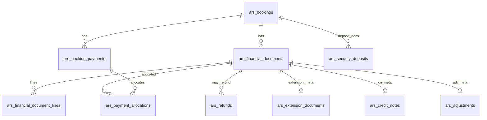

# Phase 2A — Option B Financial Document Architecture

**Status:** Design draft for Phase 2B — **not executed**  
**Constraint:** Additive tables only; no `re_invoices` / `re_leases` / `re_tenants` for ARS; no `accounting_engine.php` changes.  
**Evidence:** DEC-016 Accepted; current bridge `ars_accounting.php` + `ars_booking_payments` / deposit columns.

---

## 1. Design principles

1. Booking is master; financial docs are children (`booking_id` + `company_id` mandatory).
2. Never rewrite posted history — reverse / CN / adjustment / refund documents.
3. Adapter posts journals via existing `create_and_post_journal` / `reverse_journal` only.
4. Activity Center links via `related_entity_type` + `related_entity_id`.
5. Mobile APIs stay additive (new keys optional; no renames).
6. Logical roadmap entities map to physical tables below (invoice-like types share one header).

---

## 2. Physical model overview

**Logical → physical mapping**

| Roadmap name | Physical approach |
|--------------|-------------------|
| `ars_financial_documents` | Header for invoice-like docs |
| `ars_financial_document_lines` | Lines |
| `ars_extension_documents` | 1:1 extension metadata (+ `document_type=extension_invoice`) |
| `ars_credit_notes` | 1:1 CN metadata (+ `document_type=credit_note`) |
| `ars_adjustments` | 1:1 adjustment metadata (+ `document_type=adjustment_invoice`) |
| `ars_payment_allocations` | Payment ↔ document open-item |
| `ars_refunds` | Refund documents (may link payment + CN) |
| `ars_security_deposits` | Deposit lifecycle documents (parallel to booking deposit fields during transition) |

---

## 3. `ars_financial_documents`

**Purpose:** Queryable ARS invoice / CN / extension / service / adjustment headers.

| Column | Type | Notes |
|--------|------|-------|
| `id` | BIGINT PK AI | |
| `company_id` | INT NOT NULL | Posting/ops company (BC-01) |
| `booking_id` | INT NOT NULL | FK logical → `ars_bookings.id` |
| `guest_id` | INT NULL | Snapshot of booking guest |
| `document_type` | ENUM | `original_invoice`,`extension_invoice`,`service_invoice`,`adjustment_invoice`,`credit_note` |
| `document_number` | VARCHAR(40) NOT NULL | Unique per company |
| `document_date` | DATE NOT NULL | |
| `status` | ENUM | `draft`,`posted`,`partially_paid`,`paid`,`void`,`reversed` |
| `currency` | CHAR(3) | Default AED |
| `subtotal` / `vat_amount` / `total_amount` | DECIMAL(12,2) | |
| `amount_allocated` / `balance_due` | DECIMAL(12,2) | Updated by allocations |
| `vat_mode` / `vat_rate` | | Mirror booking modes |
| `journal_id` | INT NULL | `re_journal_headers.id` |
| `reversal_journal_id` | INT NULL | |
| `parent_document_id` | BIGINT NULL | CN/adjustment → original |
| `idempotency_key` | VARCHAR(120) NULL | Unique per company |
| `source` | VARCHAR(40) | `adapter`,`backfill`,`manual` |
| `notes` | TEXT NULL | |
| `created_by` / `created_at` / `updated_at` / `posted_at` / `posted_by` | Audit | |

**Constraints:** UNIQUE(`company_id`,`document_number`); UNIQUE(`company_id`,`idempotency_key`); INDEX(`company_id`,`booking_id`,`document_date`); INDEX(`journal_id`).

**Lifecycle:** `draft` → `posted` → (`partially_paid`|`paid`) ; void/reverse via CN or reversal journal — never edit posted totals in place.

**Compatibility:** Additive; existing `ars_bookings.journal_id` remains during transition (legacy pointer).

**Migration:** Create empty; backfill optional opening docs from existing journals (see legacy plan).  
**Rollback:** DROP TABLE only if no posted rows / or soft-disable adapter flag.

---

## 4. `ars_financial_document_lines`

**Purpose:** Line items (room nights, fees, damage, VAT line if needed).

| Column | Type | Notes |
|--------|------|-------|
| `id` | BIGINT PK | |
| `company_id` | INT NOT NULL | |
| `document_id` | BIGINT NOT NULL | FK → documents |
| `line_no` | INT NOT NULL | |
| `line_type` | VARCHAR(40) | `room`,`service`,`damage`,`fee`,`discount`,`vat`,`other` |
| `description` | VARCHAR(255) | |
| `quantity` / `unit_price` / `line_total` | DECIMAL | |
| `vat_rate` / `vat_amount` | DECIMAL | |
| `account_role` | VARCHAR(40) | Adapter hint: `revenue`,`ar`,`vat`,`liability` — not engine-specific |
| `related_charge_id` | INT NULL | `ars_booking_charges.id` |
| `meta_json` | JSON NULL | Non-sensitive |

**Constraints:** UNIQUE(`document_id`,`line_no`); INDEX(`document_id`).

---

## 5. `ars_payment_allocations`

**Purpose:** Open-item link between `ars_booking_payments` and financial documents (ARS analogue of IM allocation — **not** writing into RE allocation tables).

| Column | Type | Notes |
|--------|------|-------|
| `id` | BIGINT PK | |
| `company_id` | INT NOT NULL | |
| `booking_id` | INT NOT NULL | |
| `payment_id` | INT NOT NULL | `ars_booking_payments.id` |
| `document_id` | BIGINT NOT NULL | |
| `amount` | DECIMAL(12,2) NOT NULL | |
| `allocation_date` | DATE | |
| `journal_id` | INT NULL | If allocation posts separately (usually payment JV already exists) |
| `status` | ENUM | `active`,`reversed` |
| `idempotency_key` | VARCHAR(120) | |
| Audit fields | | |

**Constraints:** UNIQUE(`company_id`,`idempotency_key`); INDEX(`payment_id`); INDEX(`document_id`).

---

## 6. `ars_refunds`

**Purpose:** Guest refunds (stay payments), distinct from deposit refunds.

| Column | Type | Notes |
|--------|------|-------|
| `id` | BIGINT PK | |
| `company_id` / `booking_id` | INT NOT NULL | |
| `refund_number` | VARCHAR(40) | |
| `payment_id` | INT NULL | Original payment |
| `credit_note_document_id` | BIGINT NULL | |
| `amount` | DECIMAL(12,2) | |
| `method` | VARCHAR(30) | cash/bank/stripe |
| `status` | ENUM | `draft`,`posted`,`failed`,`reversed` |
| `journal_id` | INT NULL | |
| `idempotency_key` | VARCHAR(120) | |
| Audit | | |

---

## 7. `ars_security_deposits`

**Purpose:** First-class deposit documents (receive / partial refund / forfeit) while booking columns remain operational mirrors during transition.

| Column | Type | Notes |
|--------|------|-------|
| `id` | BIGINT PK | |
| `company_id` / `booking_id` | INT NOT NULL | |
| `deposit_number` | VARCHAR(40) | |
| `event_type` | ENUM | `hold_set`,`received`,`partial_refund`,`full_refund`,`forfeit` |
| `amount` | DECIMAL(12,2) | |
| `status` | ENUM | `pending`,`posted`,`reversed` |
| `journal_id` | INT NULL | |
| `payment_id` | INT NULL | Stripe/manual |
| `idempotency_key` | VARCHAR(120) | |
| Audit | | |

**Transition:** Phase 2B dual-writes booking deposit fields + this table until cutover Confirmed.

---

## 8. `ars_extension_documents` / `ars_credit_notes` / `ars_adjustments`

**Purpose:** Typed metadata 1:1 with `ars_financial_documents` (keeps header generic for reports).

### `ars_extension_documents`
- `document_id` PK/FK  
- `prior_check_out` / `new_check_out` / `added_nights`  
- `rate_basis` notes  

### `ars_credit_notes`
- `document_id` PK/FK  
- `reason_code` (`cancel`,`early_checkout`,`rate_correction`,`other`)  
- `applies_to_document_id`  

### `ars_adjustments`
- `document_id` PK/FK  
- `reason_code` (`rate_diff`,`promo`,`manual`)  
- `applies_to_document_id`  

---

## 9. Additive links on existing tables (Phase 2B migrations — not run in 2A)

| Table | Additive columns (proposed) |
|-------|-----------------------------|
| `ars_booking_payments` | `financial_document_id` NULL; keep mobile columns |
| `ars_bookings` | Optional `primary_invoice_document_id` NULL (legacy `journal_id` retained) |
| `ars_booking_charges` | `financial_document_id` / `document_line_id` NULL |

**Mobile:** Do not remove/rename payment keys; new fields additive only.

---

## 10. Relationships to journals & Activity Center

| Document | Journal | Activity `related_entity_type` |
|----------|---------|--------------------------------|
| Invoice types | `create_and_post_journal` type `invoice` ref `ars_fin_doc` | `ars_financial_document` |
| Payment | existing `ars_payment` | `ars_booking_payment` |
| Allocation | usually no new JV | `ars_payment_allocation` |
| Deposit events | `ars_deposit` / refund | `ars_security_deposit` |
| Refund | refund JV | `ars_refund` |

Deep link: staff document view page (Phase 2B UI) + journal_entry_view for `journal_id`.

---

## 11. Indexes & performance

- All queries scoped by `company_id` first.  
- Booking hub: `(company_id, booking_id, document_date)`.  
- Idempotency unique keys prevent double-post.  
- Avoid unbounded lists: paginate document lists on booking.

---

## 12. Migration & rollback strategy (Phase 2B)

1. Create tables empty (IF NOT EXISTS).  
2. Feature flag `ars_financial_adapter_enabled` (settings) default off.  
3. Backfill historical snapshots (legacy plan) — optional.  
4. Enable adapter for new confirms only.  
5. Rollback: disable flag; tables remain; do not delete posted journals.

**Phase 2A does not execute these migrations.**

---

## 13. Open dependencies

All BC-01…BC-15 items that affect document amounts/timing must be Confirmed before Phase 2B posts new document types beyond mirroring current confirm/payment/deposit behaviour.
