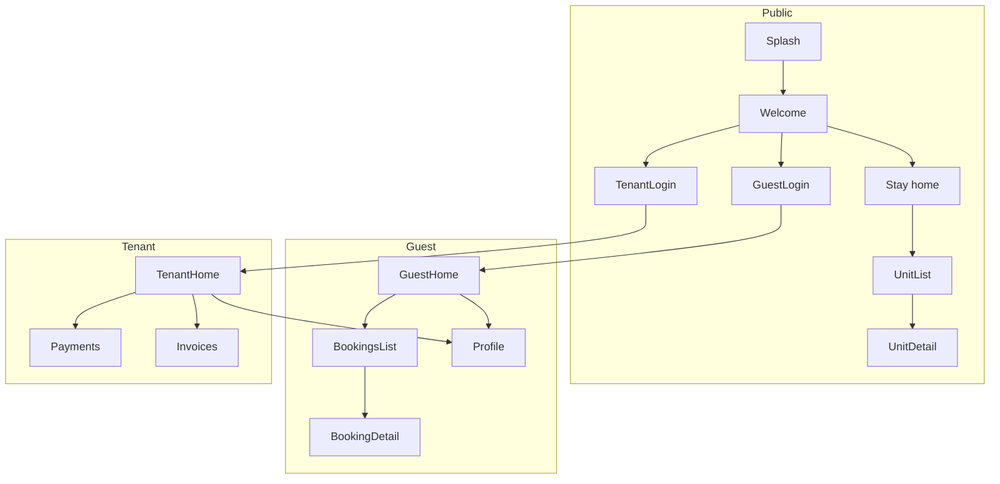

# Flutter customer app — MVP foundation (plan only)

**Status:** Architecture and implementation order for approval. **No Phase E.** Detailed UI implementation waits for your go-ahead after this document.

**Backend:** Use the existing PHP API at `/api/customer/v1` (see [customer_api_local_qa.md](customer_api_local_qa.md) and [unified_customer_app_mvp_plan_and_api.md](unified_customer_app_mvp_plan_and_api.md)).

**Out of scope for this foundation:** maintenance, cleaning, pest, renewals, document uploads, Stripe, push notifications, full pixel-perfect UI polish.

---

## 1) Flutter folder structure (proposed)

Recommended app root: **`customer_app/`** at the repository root (sibling to `stay/`, `tenant_portal/`, `api/`).

```
customer_app/
├── pubspec.yaml
├── analysis_options.yaml
├── README.md
├── lib/
│   ├── main.dart
│   ├── app.dart                          # MaterialApp.router, theme, env
│   ├── config/
│   │   ├── app_config.dart               # baseUrl, flags (useMockApi)
│   │   └── env.dart                      # optional: dev/staging/prod
│   ├── router/
│   │   ├── app_router.dart               # GoRouter configuration + redirects
│   │   ├── routes.dart                   # route path constants
│   │   └── route_guards.dart             # pure functions: canAccess*, parse auth mode
│   ├── api/
│   │   ├── api_client.dart               # Dio singleton + interceptors
│   │   ├── api_exception.dart            # maps { ok: false, error } → typed failure
│   │   ├── endpoints.dart                # path builders (customer v1)
│   │   └── interceptors/
│   │       ├── auth_interceptor.dart     # attach Bearer; optional X-Tenant-Lease-Id
│   │       └── logging_interceptor.dart  # debug only
│   ├── features/
│   │   ├── splash/
│   │   │   └── presentation/splash_screen.dart
│   │   ├── welcome/
│   │   │   └── presentation/welcome_screen.dart
│   │   ├── auth/
│   │   │   ├── guest/
│   │   │   │   ├── data/guest_auth_repository.dart
│   │   │   │   └── presentation/guest_login_screen.dart
│   │   │   └── tenant/
│   │   │       ├── data/tenant_auth_repository.dart
│   │   │       └── presentation/tenant_login_screen.dart
│   │   ├── stay/                         # public ARS
│   │   │   ├── data/stay_repository.dart
│   │   │   └── presentation/
│   │   │       ├── stay_home_screen.dart
│   │   │       ├── stay_unit_list_screen.dart
│   │   │       └── stay_unit_detail_screen.dart
│   │   ├── guest_home/
│   │   │   └── presentation/guest_home_screen.dart
│   │   ├── guest_bookings/
│   │   │   ├── data/bookings_repository.dart
│   │   │   └── presentation/
│   │   │       ├── guest_bookings_list_screen.dart
│   │   │       └── guest_booking_detail_screen.dart
│   │   ├── tenant_dashboard/
│   │   │   ├── data/tenant_dashboard_repository.dart
│   │   │   └── presentation/tenant_home_screen.dart
│   │   ├── tenant_payments/
│   │   │   └── presentation/tenant_payments_screen.dart
│   │   ├── tenant_invoices/
│   │   │   └── presentation/tenant_invoices_screen.dart
│   │   └── profile/
│   │       └── presentation/profile_shell_screen.dart
│   ├── core/
│   │   ├── session/
│   │   │   ├── session_state.dart        # sealed class or enum: unauthenticated | guest | tenant
│   │   │   ├── auth_token_storage.dart   # flutter_secure_storage
│   │   │   └── session_controller.dart   # Riverpod Notifier: login/logout/switchLease
│   │   ├── models/                       # DTOs matching API (json_serializable optional)
│   │   └── widgets/                      # shared buttons, error view, loading
│   └── providers.dart                    # optional barrel for @Riverpod exports
├── test/
│   └── router/                           # redirect unit tests (high value)
└── assets/                               # logos, later l10n
```

**Principles**

- **Feature-first** under `lib/features/` keeps ARS, guest, and tenant flows isolated.
- **`core/session`** owns tokens, active tenant lease id (memory + secure storage), and refresh strategy later.
- **`api/`** stays thin: Dio + interceptors + repositories call endpoints; no UI in repositories.

---

## 2) Navigation map

**Modes (product):** after welcome, user is either **public browse**, **guest session**, or **tenant session**. Router **redirects** enforce session class per route branch.

**Top-level routes (names illustrative; align with `routes.dart`):**

| Route | Screen | Access |
|-------|--------|--------|
| `/splash` | Splash | Public |
| `/welcome` | Welcome / mode selection | Public |
| `/login/guest` | Guest login | Public |
| `/login/tenant` | Tenant login | Public |
| `/stay` | Public ARS browse home | Public |
| `/stay/units` | ARS unit list | Public |
| `/stay/units/:id` | ARS unit detail | Public |
| `/guest` | Guest home | Guest |
| `/guest/bookings` | Guest bookings list | Guest |
| `/guest/bookings/:id` | Guest booking detail | Guest |
| `/tenant` | Tenant home (dashboard summary entry) | Tenant |
| `/tenant/payments` | Tenant payments (installments + history tabs optional later) | Tenant |
| `/tenant/invoices` | Tenant invoices list | Tenant |
| `/profile` | Profile shell | Guest or Tenant (not public-only) |

**Optional query params:** e.g. `/stay/units?building=…&check_in=…` for parity with API.

**Mermaid (navigation + guard intent)**



**Deep links (later):** keep path prefixes stable (`/stay/...`, `/guest/...`, `/tenant/...`) so `go_router` can grow without renaming.

---

## 3) State management structure (Riverpod)

**Packages:** `flutter_riverpod` + `riverpod_annotation` (optional codegen) **or** plain `NotifierProvider` for fewer moving parts at MVP.

**Layers**

| Layer | Responsibility |
|--------|----------------|
| **Session** | `SessionController` (Notifier): holds `SessionState`, reads/writes secure tokens, exposes `loginGuest`, `loginTenant`, `logout`, `setTenantLeaseId`, `restoreSession` on startup |
| **Repositories** | One per bounded context: `StayRepository`, `GuestAuthRepository`, `BookingsRepository`, `TenantAuthRepository`, `TenantDashboardRepository` — async methods return domain models or `AsyncValue` |
| **UI providers** | `FutureProvider` / `AsyncNotifierProvider` for screen-specific data (e.g. `unitDetailProvider(id)`) |

**Session state (sketch)**

```dart
sealed class SessionState { … }
// e.g. Unauthenticated | GuestSession(GuestProfile) | TenantSession(TenantProfile, activeLeaseId)
```

**Tenant lease id:** store `activeLeaseId` in `SessionController` when user picks a lease (from login payload or settings); persist in secure storage next to tenant refresh token. Dio interceptor reads it for `X-Tenant-Lease-Id`.

**Mock-to-real:** `AppConfig.useMockApi` switches repository implementation (in-memory fixtures vs `Dio`). Same interfaces keep screens stable.

---

## 4) API service structure (dio)

**Single `Dio` instance** in `api_client.dart`:

- **Base URL:** from `AppConfig` (e.g. `http://10.0.2.2/herosysgro/api/customer/v1` Android emulator, device-specific LAN IP for physical device, or `?route=` style only if you standardize on one URL shape).
- **Default headers:** `Content-Type: application/json`, `Accept: application/json`.
- **Response parsing:** expect `{ "ok": true, "data": ... }`; on `ok: false` throw `ApiException(code, message, details)`.
- **Auth interceptor:** if route requires guest or tenant token, attach `Authorization: Bearer <access>`. For tenant lease-scoped calls, attach `X-Tenant-Lease-Id` from session.
- **401 handling:** try refresh once (`POST auth/refresh` with refresh token from secure storage), retry request; on failure clear session and redirect to `/welcome` (guest vs tenant refresh token stored separately or namespaced keys).

**Endpoint grouping (mirror PHP):**

| Repository | Example methods |
|------------|-----------------|
| `StayRepository` | `getSettings()`, `getBuildings()`, `getUnits(filters)`, `getUnit(id)`, `getQuote(unitId, …)` |
| `GuestAuthRepository` | `login`, `register` (if needed later), `me` |
| `BookingsRepository` | `list`, `get(id)`, `create` (Phase C already on API) |
| `TenantAuthRepository` | `login`, `me`, `setActiveLease(leaseId)` |
| `TenantDashboardRepository` | `dashboard`, `installments(leaseId)`, `payments(leaseId)`, `penalties(leaseId)`, `invoices(leaseId)` |

**No Stripe / push** in this layer until explicitly added.

---

## 5) Route guard logic

**Source of truth:** `SessionState` from `SessionController` (Riverpod).

**Rules**

| Zone | Condition to enter | Redirect if false |
|------|--------------------|-------------------|
| **Public** (splash, welcome, guest/tenant login, `/stay/**`) | Always allowed | — |
| **Guest** (`/guest/**`, guest profile) | `SessionState is GuestSession` | → `/welcome` or `/login/guest` |
| **Tenant** (`/tenant/**`, tenant profile) | `SessionState is TenantSession` | → `/welcome` or `/login/tenant` |
| **Profile shell** | Guest or Tenant | → `/welcome` if unauthenticated |

**Implementation in `go_router`:** use `redirect: (context, state) { … }` reading `ref.read(sessionControllerProvider)` (via `ProviderScope` + `GoRouter` created with a `Listenable` that notifies when session changes, or `refreshListenable` tied to a small `ChangeNotifier` the session updates).

**Do not** rely on guest token for tenant routes: token `typ` can be encoded in JWT payload if you decode claims client-side for UX only; **authorization remains server-side**.

**Tenant lease guard:** before navigating to `/tenant/payments` or `/tenant/invoices`, ensure `activeLeaseId != null`; if null but leases exist, redirect to a small “Select lease” placeholder or auto-pick first lease from `GET auth/tenant/me` then persist.

---

## 6) Screen implementation order (recommended)

Build in vertical slices so each step is runnable and testable against the real API (or mocks).

| Order | Deliverable | Why first |
|-------|-------------|-----------|
| 1 | `flutter create` + `pubspec` deps (`go_router`, `flutter_riverpod`, `dio`, `flutter_secure_storage`) + `main.dart` / `app.dart` | Bootstraps app |
| 2 | `AppConfig` + `ApiClient` + envelope parser + **Splash** → **Welcome** | Validates config and navigation shell |
| 3 | **SessionController** + secure storage + **route guards** on stub screens | Unlocks guest/tenant branches |
| 4 | **Guest login** + `POST auth/guest/login` + persist tokens → **Guest home** placeholder | End-to-end auth slice |
| 5 | **Tenant login** + `POST auth/tenant/login` + lease id persistence → **Tenant home** placeholder | Tenant auth slice |
| 6 | **Public stay:** `StayRepository` + **ARS browse home** → **unit list** → **unit detail** (+ quote call optional on detail) | Largest visible MVP; no login |
| 7 | **Guest bookings list** + **detail** (`GET stay/bookings`, `GET …/id`) | Guest value after login |
| 8 | **Tenant dashboard** (`GET tenant/dashboard` + header) | Tenant home data |
| 9 | **Tenant payments** + **Tenant invoices** (lease-scoped GETs + header) | Completes D-light UI shell |
| 10 | **Profile shell** (show mode, logout, link to mock “settings”) | Cleanup and logout paths |

**Defer until after approval / later passes:** booking create form UX, tenant lease picker UI polish, pagination, image caching strategy, l10n, deep links, error retry UX.

---

## After you approve

1. Run `flutter create customer_app` (or agreed folder name) under the repo root.  
2. Apply this folder layout and add placeholder `Scaffold` screens with titles only (no detailed UI).  
3. Wire `go_router` + `SessionController` + `Dio` to the real API using [customer_api_local_qa.md](customer_api_local_qa.md) base URL notes.

If you want a different root folder name (`mobile/`, `apps/customer/`) or package naming, say so before implementation.

---

## Locked decisions (implementation — approved)

1. **Base URL:** `AppConfig` supports **Android emulator** (`10.0.2.2` + configurable `APP_PATH_PREFIX`, default `/herosysgro`), **LAN** (`API_ENV=lan` + `LAN_HOST`), and **production** (`API_ENV=production` + `PROD_API_BASE`). Optional `API_USE_INDEX_PHP` for `index.php?route=` style.
2. **Token storage:** **flutter_secure_storage** for all access/refresh tokens (guest and tenant namespaces).
3. **Tenant lease:** `activeLeaseId` in **Riverpod** (`SessionNotifier` / `AppSession`) **and** secure storage key `customer_app_tenant_active_lease_id`.
4. **API envelope:** `ApiClient` strictly parses `{ "ok": true, "data" }` / `{ "ok": false, "error" }` and throws `ApiException` on failure.

**Shell implemented (no full UI):** `customer_app/` — `go_router` + guards, Splash → Welcome, `SessionNotifier`, `ApiClient`, `AppConfig`. Run `flutter create .` inside `customer_app` if platform folders are missing (local Flutter/Xcode required).
