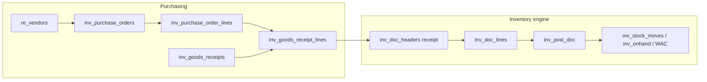

# Phase 2 — Purchasing & receiving (design for approval)

**Out of scope for this phase:** internal consumption integrations, POS, AP invoice matching (optional note only), GL journals (future `re_*` layer per `DECISIONS.md`).

**Goal:** Vendor-linked purchase orders, goods receipt (GRN) with optional PO reference, partial receipts, stock increase via the existing inventory receipt posting path, and purchase history reporting.

---

## 1) Architecture & workflow

### Vendor / supplier master
- **Reuse** existing table **`re_vendors`** (already in project migrations) as the supplier master: `company_id`, `vendor_name`, contact fields, `vendor_type` (use **`supplier`** for inventory PO/GRN), `status`, payment terms, etc.
- Inventory UI under **Purchasing** lists suppliers (`vendor_type = 'supplier'` or all active vendors—product decision) and allows create/edit minimal fields needed for POs, **or** deep-link to existing Real Estate vendor screens if you prefer a single maintenance path.
- **Rationale:** One vendor record across modules; avoids duplicate `inv_vendors` unless you later need a strict separation (not recommended for MVP).

### Documents & statuses
| Entity | Purpose | Typical statuses |
|--------|---------|------------------|
| **Purchase order (PO)** | Commitment to buy: vendor, dates, lines (item, qty, price) | `draft` → `open` (approved for receiving) → `closed` / `cancelled` |
| **Goods receipt (GRN)** | Physical receipt; drives inventory | `draft` → `posted` |

- **PO does not move stock** until a **GRN is posted**.
- **GRN** can be **against a PO** (lines tied to PO lines, receive up to remaining qty) or **standalone** (no PO: spot purchase), still with `vendor_id` + receipt location.

### End-to-end flow (happy path)
1. Select supplier (`re_vendors`), create **PO** in `draft`, add lines (item, UoM, qty, unit price).
2. **Open** PO (approve) when ready to receive against it.
3. Create **GRN** from PO (prefill lines with **remaining** qty = ordered − already received) **or** create blank GRN and add lines manually.
4. Set **receipt location** (To warehouse), costs, lot/serial as required by item flags.
5. **Post GRN** → engine creates/links an inventory **`receipt`** document and calls existing **`inv_post_doc`** → on-hand + WAC update, `inv_stock_moves` rows, `source_*` points back to GRN.

### Partial receipt
- Each **PO line** stores `qty_ordered` and running **`qty_received`** (sum of **posted** GRN lines linked to that PO line).
- Each GRN line stores **`qty_received`** (this event). Posting validates: cumulative received ≤ ordered unless **`allow_over_receipt`** (header flag) is set for that GRN.
- **Backorder:** remaining qty = ordered − received; visible on PO detail and when creating the next GRN.

### Purchase history
- **Posted GRNs** joined to vendors, items, dates, quantities, extended value (qty × unit cost used for inventory).
- Optional join to PO for “PO vs GRN” traceability.

---

## 2) Database changes

**New tables** (prefix `inv_`, `company_id` on headers, consistent with Phase 1):

### `inv_purchase_orders`
- `id`, `company_id`, `vendor_id` → `re_vendors.id`
- `po_no` VARCHAR UNIQUE per company (sequence e.g. `INV-PO-YYYY-#####` or `PO-{company}-…`)
- `po_date`, `expected_date` NULL
- `status` ENUM or VARCHAR: `draft`, `open`, `closed`, `cancelled`
- `currency` optional default company currency
- `notes`, `created_by`, `created_at`, `updated_at`
- Indexes: `(company_id, vendor_id, po_date)`, `(company_id, status)`

### `inv_purchase_order_lines`
- `id`, `header_id`, `company_id`, `item_id`, `uom_id`
- `qty_ordered`, `unit_price` (optional tax fields later)
- `qty_received` DECIMAL NOT NULL DEFAULT 0 (maintained by application on GRN post)
- `line_no` or `sort_order`
- Optional: `requested_date`, `notes`
- FK/header index as Phase 1 doc lines

### `inv_goods_receipts`
- `id`, `company_id`, `vendor_id`
- `po_id` NULL (standalone GRN if NULL)
- `grn_no` UNIQUE per company (`INV-GRN-YYYY-#####` recommended)
- `receipt_date`, `location_to_id` → `inv_locations.id` (default receive location)
- `status`: `draft`, `posted`
- `allow_over_receipt` TINYINT(1) DEFAULT 0
- `inventory_doc_id` NULL → `inv_doc_headers.id` (set when posted: linked **receipt** document)
- `notes`, `posted_by`, `posted_at`, `created_by`, `created_at`, `updated_at`
- `source_module` default `'inventory'`, `source_table` `'inv_goods_receipts'`, `source_id` self id (for symmetry with other modules)

### `inv_goods_receipt_lines`
- `id`, `header_id`, `company_id`
- `po_line_id` NULL (required when GRN created from PO for that line)
- `item_id`, `uom_id`, `qty_received`, `unit_cost` (inventory / WAC input—align with receipt rules)
- `lot_id` / lot text / serial as needed (mirror `inv_doc_lines` capabilities or store only text and resolve in posting like Phase 1)
- `location_to_id` NULL (override header receive location per line if needed)

**No change** to core inventory movement tables beyond what Phase 1 already provides; GRN posting **creates** `inv_doc_headers` + `inv_doc_lines` and reuses **`inv_post_doc`**.

**Optional migration tweak:** ensure `inv_doc_headers.vendor_id` is populated when posting from GRN (column already exists in Phase 0).

---

## 3) Files to create / modify

### Create
| Path | Role |
|------|------|
| `migrations/inventory_phase2_purchasing.sql` | Tables + sequences for `po_no` / `grn_no` if not reusing `inv_doc_sequences` with new prefixes |
| `includes/inventory/inv_purchasing.php` (or split `inv_po.php` / `inv_grn.php`) | CRUD helpers, PO line receive totals, GRN→inventory doc builder |
| `modules/inventory/purchasing/` or flat files | `vendors.php` (supplier subset of `re_vendors`), `purchase_orders.php`, `purchase_order_edit.php`, `goods_receipts.php`, `goods_receipt_edit.php`, `purchase_history.php` |
| `includes/permissions/...` | Extend permissions (see below) |

### Modify
| Path | Role |
|------|------|
| `includes/permissions/inventory_permissions.php` | Add purchasing keys (e.g. `inventory_purchasing` or `inventory_po` + `inventory_grn`) |
| `includes/permissions.php` | Register new permission groups if required by RBAC loader |
| `modules/inventory/includes/inv_layout_header.php` | Nav: Purchasing (vendors/suppliers, POs, GRNs, purchase history) |
| `docs/inventory/PHASES.md` | Mark Phase 2 acceptance criteria when implemented |
| `docs/inventory/SETUP.md` | New migration file name |

### Posting integration
| Path | Role |
|------|------|
| `includes/inventory/inv_posting.php` | Ideally **no** change to core receipt math; add thin **`inv_post_grn()`** (or similar) that builds header/lines and calls `inv_create_doc` / `inv_add_line` / `inv_post_doc`, updates PO `qty_received`, sets `inv_goods_receipts.inventory_doc_id` |

---

## 4) Posting logic

1. **Preconditions:** GRN `draft`, at least one line, valid `vendor_id`, receive location(s), items active, lot/serial rules satisfied (delegate to same validation path as manual receipt by building `inv_doc_lines`).
2. **Build inventory receipt:**
   - `doc_type = 'receipt'`
   - `vendor_id` from GRN
   - `location_to_id` from line or header
   - `source_module = 'inventory'`, `source_table = 'inv_goods_receipts'`, `source_id = grn_id`
   - Lines: qty = `qty_received`, `unit_cost` from GRN line, UoM, lot/serial fields copied
3. **`inv_post_doc($conn, $docId, $userId, $allowNegative)`** — unchanged behavior for receipt (WAC, on-hand, ledger).
4. **After successful post:**
   - Set GRN `status = posted`, `posted_at`, `inventory_doc_id`
   - For each line with `po_line_id`: increment `inv_purchase_order_lines.qty_received` by received qty; if sum received ≥ ordered, optionally mark line complete; if all lines complete, set PO `status = closed` (policy flag)
5. **Idempotency:** Posting a GRN twice must be impossible (`status != draft` guard).

**Standalone GRN (no PO):** skip PO line updates; inventory still posts as receipt.

**Over-receipt:** If `allow_over_receipt = 1`, allow `qty_received` sum > ordered; otherwise reject with clear error.

---

## 5) Deployment steps

1. **Backup** database.
2. Run **`migrations/inventory_phase2_purchasing.sql`** on the target DB.
3. Confirm **`re_vendors`** exists (run `phase2_vendor_management.sql` or project comprehensive migration if missing).
4. Deploy PHP changes; clear opcache if used.
5. **RBAC:** Grant new permissions to appropriate roles (Purchasing clerk: PO create/edit; Warehouse: GRN create/post; Manager: PO close/cancel).
6. **Smoke test:** Create supplier → PO → GRN partial → post → verify stock and PO received qty → second GRN for remainder.

---

## 6) Test checklist

### Vendor master
- [ ] Create supplier (`re_vendors`, type supplier); appears in PO/GRN vendor dropdown
- [ ] Inactive/blacklisted vendor cannot be used on new PO (validation)

### Purchase order
- [ ] Create draft PO with multiple lines; save
- [ ] Open PO; `qty_received` starts at 0
- [ ] Cancel/close PO without GRN (policy: no receiving after close)
- [ ] PO number unique per company, sequential

### GRN (with PO)
- [ ] Create GRN from open PO; lines prefilled with **remaining** qty
- [ ] Partial post: received qty &lt; ordered; PO shows partial; second GRN completes line
- [ ] Post GRN: inventory receipt created; `inv_stock_moves` / on-hand / WAC match manual receipt for same qty/cost
- [ ] `inv_doc_headers.vendor_id` and `source_*` populated
- [ ] Cannot edit posted GRN (draft only)

### GRN (standalone)
- [ ] GRN without PO; post increases stock; no PO updates

### Validation
- [ ] Over-receipt blocked when `allow_over_receipt = 0`
- [ ] Over-receipt allowed when flag set (if implemented)
- [ ] Lot/serial items rejected without required data (same as Phase 1 receipt)

### Purchase history
- [ ] Report lists posted GRNs by date range, vendor, item
- [ ] Totals match sum of GRN lines (optional compare to inventory receipt doc)

### Permissions
- [ ] User without GRN post cannot post
- [ ] User without PO create cannot create PO

### Negative / edge
- [ ] Posting failure (e.g. bad lot) rolls back GRN + no PO qty update + no duplicate receipt

---

## Approval

Approved and implemented with these adjustments:

- **Unit cost:** GRN line `unit_cost` defaults from PO line `unit_price` when receiving against a PO; user can override in the add-line form before post.
- **Correction:** Posted GRNs are read-only. **Create reversal receipt (negative)** builds a draft inventory `receipt` with negative quantities (same items/lots/serials as the posted receipt); post it from **Documents** to remove stock at WAC. Then create a new GRN if needed.
- **reference_no:** Optional on `inv_goods_receipts` for supplier delivery note / invoice reference.

---

## Implementation map (code)

- Migration: `migrations/inventory_phase2_purchasing.sql`
- Engine: `includes/inventory/inv_purchasing.php` (`inv_grn_post`, `inv_create_reversal_receipt_for_grn`, …)
- Negative receipt posting: `includes/inventory/inv_posting.php` (`receipt` with negative qty); nested `inv_post_doc` transactions supported for GRN post.
- Permissions: `inventory_purchasing` (`view`, `create`, `edit`, `post`) in `includes/permissions/inventory_permissions.php`
- UI: `modules/inventory/suppliers.php`, `purchase_orders.php`, `purchase_order_edit.php`, `goods_receipts.php`, `goods_receipt_edit.php`, `purchase_history.php`; nav in `includes/inv_layout_header.php`
