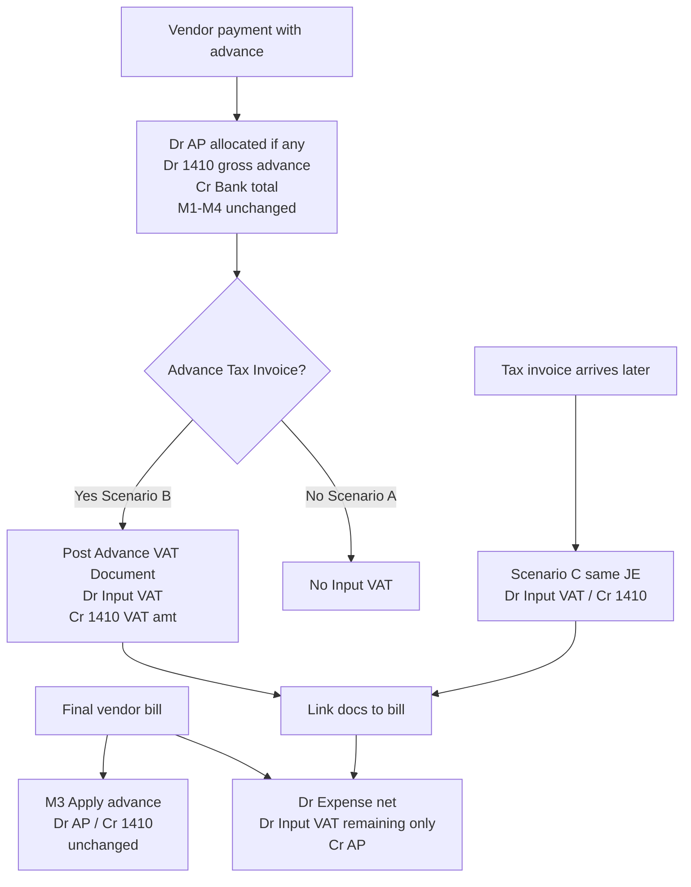

# Vendor Advances M5 – Vendor Advance VAT (Design for Approval)

**Status:** APPROVED AND IMPLEMENTED (see `vendor-advance-vat-m5-closure.md`)  
**Stack:** Shared RE `re_*` only  
**Constraint:** M1–M4 advances remain unchanged except minimal integration hooks required for VAT document linking / final-bill VAT netting  

---

## 1. Accounting audit (current state)

### 1.1 Ledger / company

- Vendor AP and advances use the **shared RE** stack (`re_journal_*`, `re_general_ledger`, `re_chart_of_accounts`).
- Cleaning `gl_*` is not involved.

### 1.2 Current Input VAT posting (vendor bills)

**Only** when a vendor bill is posted via `re_ap_post_vendor_bill()` in [`modules/realestate/includes/vendor_ap_helper.php`](../../modules/realestate/includes/vendor_ap_helper.php).

| Leg | Account | Amount |
|-----|---------|--------|
| Dr | Line expense account(s) | Line net (`subtotal`) |
| Dr | Input VAT | Sum of line `vat_amount` (if > 0.005) |
| Cr | Accounts Payable | Net + VAT |

- `reference_type = vendor_invoice`
- Input VAT account: `re_ap_input_vat_account()` → setting `re_vendor_input_vat_account_code` default **2320**, fallback **1260**
- AP: `re_ap_account()` → `re_vendor_ap_account_code` default **2130**

Line fields on `re_vendor_invoice_items`: `vat_treatment`, `vat_rate`, `vat_amount`, `subtotal`, `line_total`.  
Header has `vat_treatment`, `tax_amount` (UI total); **posting uses line `vat_amount`**, not header alone.

### 1.3 Current VAT accounts

| Code | Role in RE seed | Used by vendor bills? |
|------|-----------------|------------------------|
| **2320** | Input VAT (Recoverable) | Yes (primary) |
| **1260** | Cleaning VAT Recoverable (fallback lookup) | Only if 2320 missing for company |
| **2310** | Output VAT | Sales / leases — not vendor AP |

`re_vat_config.input_vat_account_id` exists in UI (`vat_config.php`) but is **not** used by `re_ap_post_vendor_bill`.

### 1.4 Purchase invoice workflow

1. Create bill (`bill_entry_add.php`) with lines + VAT.  
2. Post → `re_ap_post_vendor_bill` (Dr Exp + Dr Input VAT / Cr AP).  
3. Pay → `re_ap_post_vendor_payment` (Dr AP [/ Dr 1410] / Cr Bank) — **no VAT**.  
4. Apply advance → `re_ap_apply_vendor_advance` (Dr AP / Cr 1410) — **no VAT**.

Attachments: `re_vendor_bill_attachments` → `uploads/vendor_bills/`.

### 1.5 VAT reports / purchase register

| Surface | Behaviour |
|---------|-----------|
| [`vat_report.php`](../../modules/realestate/accounting/vat_report.php) | GL scan of codes **2310** / **2320**; Input VAT total uses **`credit_amount`** |
| Purchase register | **Does not exist** for RE |
| Building expense report | Shows line `vat_amount` for analysis — not a tax register |

**Known gap (pre-existing):** Bill posting **debits** 2320, but VAT report sums **credits** on 2320 — recoverable VAT from vendor bills can understate. M5 should not silently “fix” this without an explicit scoped task; design will emit correct Dr Input VAT journals and optionally extend the report to include document-based advance VAT + debit-normal input (recommended companion fix).

### 1.6 Tax configuration to reuse

| Source | Use in M5 |
|--------|-----------|
| `re_ap_input_vat_account()` | Resolve recoverable Input VAT account |
| `re_ap_advance_account()` | 1410 |
| `re_ap_setting()` / `re_ap_money()` / `re_ap_audit()` | Settings, money, audit |
| `create_and_post_journal` / `reverse_journal` | Journals (no signature changes) |
| `re_ap_post_to_vendor_ledger_required()` | Fail-closed 1410 sub-ledger when advance balance moves |
| Bill attachment pattern | File storage for tax invoices |

### 1.7 M1–M4 advances and VAT — confirmed

Advance payment / apply / unapply / reverse **never** post Input VAT. Documented in [`docs/realestate/vendor-advances.md`](vendor-advances.md). That remains the default when no Advance VAT Document exists (**Scenario A**).

---

## 2. Design principle (compatibility)

**VAT is document-driven only.** Cash leaving the bank never creates Input VAT by itself.

**Scenario B is composed without changing the M1–M4 payment journal shape:**

1. Payment posts as today: **Dr 1410 (gross) / Cr Bank (gross)** (and Dr AP if partially allocated).  
2. Advance VAT Document posts: **Dr Input VAT / Cr 1410 (VAT amount)**.  
3. Net economic effect = Dr 1410 (net) + Dr Input VAT / Cr Bank (gross).

Optional UX: “Post payment with tax invoice” runs both in **one DB transaction**.

This avoids redesigning `re_ap_post_vendor_payment` journal construction for the common case.

---

## 3. Database design

### 3.1 Table `re_vendor_advance_vat_documents`

| Column | Type | Notes |
|--------|------|--------|
| `id` | BIGINT PK | |
| `company_id` | INT NOT NULL | Isolation |
| `vendor_id` | INT NOT NULL | |
| `vendor_payment_id` | BIGINT NOT NULL | Source advance payment |
| `supplier_invoice_number` | VARCHAR(100) NOT NULL | |
| `supplier_invoice_date` | DATE NOT NULL | |
| `supplier_trn` | VARCHAR(50) NULL | |
| `taxable_amount` | DECIMAL(15,2) NOT NULL | Net |
| `vat_amount` | DECIMAL(15,2) NOT NULL | |
| `gross_amount` | DECIMAL(15,2) NOT NULL | Net + VAT (stored; must equal) |
| `currency` | CHAR(3) NOT NULL DEFAULT 'AED' | |
| `vendor_invoice_id` | INT NULL | Final bill link (Scenario D) |
| `journal_id` | INT NULL | Posted JE |
| `status` | ENUM('draft','posted','reversed') | |
| `posted_by` | INT NULL | |
| `posted_at` | DATETIME NULL | |
| `notes` | TEXT NULL | |
| `created_by` | INT NULL | |
| `created_at` / `updated_at` | DATETIME | |

**Indexes / constraints (proposed):**

- `UNIQUE (company_id, vendor_id, supplier_invoice_number)` — duplicate supplier invoice #  
- `KEY (company_id, vendor_payment_id, status)`  
- `KEY (company_id, vendor_invoice_id, status)`  
- `KEY (journal_id)`

### 3.2 Attachments `re_vendor_advance_vat_attachments`

Mirror `re_vendor_bill_attachments`:

- `company_id`, `advance_vat_document_id`, `file_name`, `file_path`, `mime_type`, `file_size`, `uploaded_by`, `uploaded_at`  
- Disk: `uploads/vendor_advance_vat/`

### 3.3 No change to

- `re_vendor_payments.advance_amount`  
- `re_vendor_advance_balances` / `re_vendor_advance_applications` semantics  
- Engine function signatures  

### 3.4 Balance implication of Scenario C / B document

Posting **Dr Input VAT / Cr 1410** reduces recoverable VAT and **reduces** the asset on 1410 by the VAT amount.

**Available advance balance (`balance_aed`)** today tracks cash advance remaining for bill application. After VAT document:

- GL 1410 decreases by VAT.  
- Operational “apply to bills” should use **net advance available** consistent with GL.

**Proposed rule (needs confirmation if preferred otherwise):**  
When an Advance VAT Document is posted, decrease `re_vendor_advance_balances` by `vat_amount` (same FOR UPDATE pattern as M3). Unapply/reverse restores it.  
Rationale: apply-to-bill consumes net commercial advance; VAT is not billable advance.

---

## 4. Journal flow

| Scenario | Journals |
|----------|----------|
| **A** | Payment only (M1–M4). No VAT JE. |
| **B** | Payment (A) + VAT doc JE in one TX. |
| **C** | VAT doc JE only (payment already posted). |
| **D** | Bill JE with **remaining** Input VAT; M3 apply separate; linked advance VAT docs marked consumed against bill. |

### 4.1 Advance VAT Document JE

| Dr/Cr | Account | Amount |
|-------|---------|--------|
| Dr | Input VAT (`re_ap_input_vat_account`) | `vat_amount` |
| Cr | 1410 Vendor Advances | `vat_amount` |

- `reference_type = vendor_advance_vat_document`  
- `reference_id = document_id`  
- Period lock via existing engine  
- 1410 vendor sub-ledger via `re_ap_post_to_vendor_ledger_required` (credit)

### 4.2 Reverse Advance VAT Document

- `reverse_journal`  
- Restore advance balance (+ VAT)  
- Status `reversed`  
- Blocked if document is linked to a posted final bill in a way that would strand bill VAT (see validations)

### 4.3 Final bill (Scenario D) — remaining Input VAT

Let:

- `B` = bill total Input VAT (sum line `vat_amount`)  
- `A` = sum of **posted** Advance VAT Documents linked to this bill (or to payments applied/allocated to this bill — see open confirmation)  
- `R = max(0, B − A)`

Bill journal:

| Dr/Cr | Account | Amount |
|-------|---------|--------|
| Dr | Expense(s) | Net |
| Dr | Input VAT | **R only** (omit leg if R ≈ 0) |
| Cr | AP | Net + **B** (full payable incl. full VAT on bill) |

**Important:** AP credit stays **full bill total** (supplier is owed gross). Already-recovered advance VAT sits in Input VAT; advance application (M3) clears AP using 1410 net of prior VAT credits.

**Open confirmation:** Exact AP/1410 interplay when bill VAT was partly recovered on advance — propose UAT with sample numbers before coding (see §8).

---

## 5. UI mockup (textual)

### 5.1 Entry: Advance VAT Document

**Nav:** Purchases & Expenses → **Advance VAT Documents** (new) + action on Payment Made / Payment view.

**Form fields:**

- Vendor (required)  
- Source advance payment (dropdown: posted payments with `advance_amount > 0` and remaining capacity)  
- Supplier invoice #, date, TRN  
- Taxable amount, VAT amount, Gross (auto = net + VAT)  
- Attachment(s)  
- Notes  
- Actions: Save Draft / Post / Reverse (if posted)

**Payment Made (optional panel):**  
“Supplier provided Advance Tax Invoice” → expand same fields → on Post Payment, create+post VAT doc in same transaction (**Scenario B**).

### 5.2 Final bill

On bill view / post:

- Panel: **Linked Advance VAT Documents** (select posted docs for this vendor/payment)  
- Show: Bill VAT, Already recovered on advances, **Remaining to post**  
- Post uses remaining R  

### 5.3 Reports

| Report | Change |
|--------|--------|
| Vendor SOA | Lines / card for Advance VAT docs (informational) |
| Vendor Ledger | 1410 sub-ledger already moves; optional note |
| VAT Report | Include `vendor_advance_vat_document` journals; prefer debit-based input for 2320 (**scoped companion**) |
| Purchase register | **New lightweight register** listing bill VAT + advance VAT docs (document-driven), company-scoped |
| Audit | `re_ap_audit` actions: `advance_vat_posted`, `advance_vat_reversed`, `advance_vat_linked_bill` |
| Journal drill-down | Existing journal view by `reference_type` |

---

## 6. Migration plan

1. Additive SQL: `migrations/re_vendor_advance_vat_documents.sql`  
   - Create documents + attachments tables  
   - No COA changes (reuse 2320 / setting)  
   - No alter of payment/advance tables required for MVP  
2. Deploy code (helpers + UI) after migration.  
3. No backfill (no historical advance VAT assumed).  
4. Rollback: reverse any posted docs; drop tables only if unused (dev).

Human approval required before running migration on each environment.

---

## 7. Risk analysis

| Risk | Severity | Mitigation |
|------|----------|------------|
| Changing payment JE shape breaks M1–M4 / M6 | High | Prefer compose B = A + VAT doc; leave payment JE unchanged |
| Double Input VAT on final bill | Critical | Link docs; bill posts only remaining R; tests T-D* |
| Advance balance vs GL 1410 drift after VAT doc | High | Adjust `balance_aed` by VAT on post/reverse; FOR UPDATE |
| VAT report still sums credits on 2320 | Medium | Companion report fix; document-driven purchase register |
| `re_vat_config` vs settings mismatch | Low | Reuse `re_ap_input_vat_account()` only |
| Attachment / TRN compliance | Medium | Require attachment + invoice # for Post (configurable) |
| Period lock / company isolation | High | Engine period lock; all queries `company_id`; fail closed |
| Engine signature / Cleaning gl_* | — | Forbidden; not in scope |

---

## 8. Open confirmations (need business sign-off)

1. **Balance:** Confirm decreasing `re_vendor_advance_balances` by VAT amount on VAT doc post.  
2. **Scenario D linking:** Manual link of VAT docs to final bill vs auto-link via payments applied to that bill.  
3. **AP credit on bill:** Confirm Cr AP = full bill gross while Input VAT debit = remaining only (standard recoverable VAT already taken on advance).  
4. **Partial VAT docs:** Multiple docs per payment allowed until sum(VAT) ≤ remaining advance asset on that payment (gross advance − prior VAT docs − applied amounts — exact formula in implementation).  
5. **Companion VAT report debit fix:** In scope for M5 or separate ticket?

---

## 9. Test matrix (proposed)

| ID | Scenario | Expected |
|----|----------|----------|
| T-A01 | Advance payment no VAT doc | Dr 1410 / Cr Bank; no Input VAT; M6 T03 still passes |
| T-B01 | Payment + VAT doc same TX | Payment JE unchanged shape; VAT JE Dr Input VAT / Cr 1410; balance −VAT |
| T-C01 | VAT doc after payment | Same as B JE; payment untouched |
| T-C02 | Partial VAT then second doc | Both post; sum VAT ≤ capacity |
| T-C03 | VAT exceeds remaining advance | Reject; rollback |
| T-C04 | Duplicate supplier invoice # | Reject |
| T-D01 | Final bill, no advance VAT | Bill VAT full (current behaviour) |
| T-D02 | Final bill + linked advance VAT = full bill VAT | Bill JE no Input VAT leg (or 0); AP full; no double recovery |
| T-D03 | Final bill VAT > linked advance VAT | Bill Input VAT = difference |
| T-D04 | Apply advance (M3) after VAT docs | Apply still Dr AP / Cr 1410; no VAT on apply |
| T-R01 | Reverse VAT doc | Reversal JE; balance restored; status reversed |
| T-R02 | Reverse VAT doc linked to posted bill | Blocked until unlink / bill handling |
| T-X01 | Cross-company payment/doc | Reject |
| T-X02 | Locked period | Engine reject |
| T-REG01 | Legacy fully allocated payment | Unchanged (no VAT path) |
| T-REP01 | Purchase register / VAT report shows advance VAT docs | Present |

---

## 10. Implementation milestones (after approval only)

| Milestone | Scope |
|-----------|--------|
| M5.1 | Migration + helper post/reverse + validations |
| M5.2 | UI document CRUD + Payment Made optional panel (B) |
| M5.3 | Final bill link + remaining VAT on `re_ap_post_vendor_bill` (**minimal hook**) |
| M5.4 | SOA / purchase register / VAT report companion + audits |
| M5.5 | Test matrix T-A* … T-REP* |

**Explicit non-goals:** Redesign advances, redesign bills UI/workflow (beyond link panel), engine signature changes, Cleaning `gl_*`, refunds.

---

## 11. Recommendation

**Proceed to implementation only after approval of:**

1. Compose Scenario B as Payment (M1–M4) + VAT Document JE (no payment JE redesign).  
2. Decrease advance balance by VAT on document post.  
3. Scenario D remaining-VAT rule on bill post with explicit document links.  
4. Whether VAT report debit fix is in M5 or a follow-up.

**No open M5 implementation tasks remain.** Refunds are a separate follow-up outside M5.
