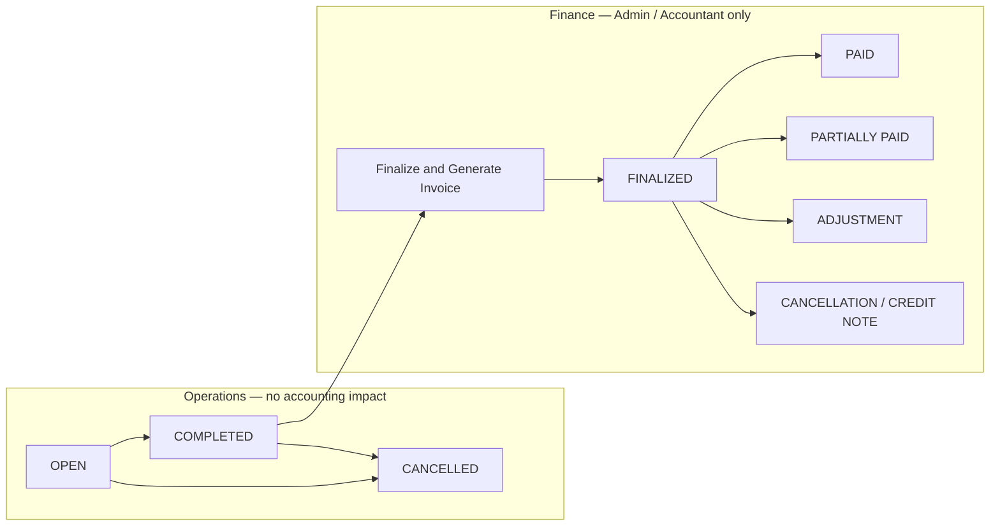
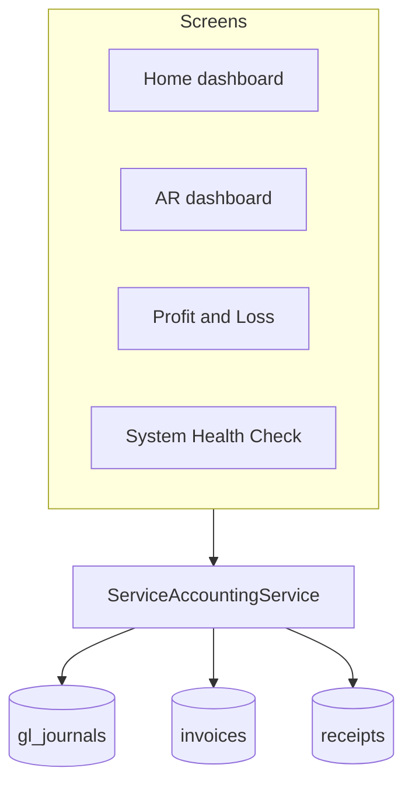

# Service Management Module — Job & Accounting Workflow

Cleaning v1 visual reference. Operations stay simple; accounting happens at one controlled step.

## End-to-end flow

## Status meanings

| Stage | Who acts | What happens | Accounting |
|-------|----------|----------------|------------|
| **OPEN** | Receptionist / Admin | Create booking, edit schedule, assign workers, change price | None |
| **COMPLETED** | Supervisor / Admin (if allowed) | Confirm job is done | None |
| **CANCELLED** | Receptionist / Admin | Cancel before finalization | None |
| **FINALIZED** | **Admin / Accountant only** | Freeze amounts, create invoice, post GL, lock financially | Invoice + GL + AR |
| **PAID** | Accountant | Record payment against invoice | Receipt + GL |
| **ADJUSTMENT** | Accountant | Credit note or adjustment invoice after finalized change request | CN / adjustment JV |
| **CANCELLATION** | Accountant | Reverse finalized job (credit note / void) | Reversal entries |

## Role permissions (target)

| Action | Receptionist | Admin | Accountant |
|--------|:------------:|:-----:|:----------:|
| Create / edit OPEN job | Yes | Yes | Yes |
| Assign workers | Yes | Yes | Yes |
| Cancel OPEN job | Yes | Yes | Yes |
| Mark COMPLETED | If permitted | Yes | Yes |
| **Finalize & Generate Invoice** | **No** | **Yes** | **Yes** |
| Record payment | No | Optional | Yes |
| Request adjustment | Yes | Yes | Approves |
| Credit note / JV | No | No | Yes |

Permission key for finalize (Phase 2+): `sm.jobs.finalize` — granted to Admin and Account roles by default, not Operation/receptionist.

## One source of truth (financial reads)

- **Revenue (P&L):** posted invoice journals on revenue accounts  
- **Customer balance:** invoice totals minus receipt allocations  
- **Expenses:** posted expense journals  
- **Profit:** revenue − expenses from the same service  

## After finalization (never silent)

| Change | Correct path |
|--------|----------------|
| Amount increase | Adjustment invoice |
| Amount decrease | Credit note |
| Cancel finalized job | Credit note + reversal |
| Small correction | Approved accounting adjustment JV |

Receptionist: **Request Adjustment** or **Request Cancellation** only.
